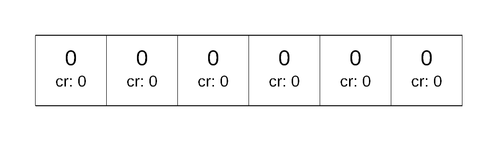
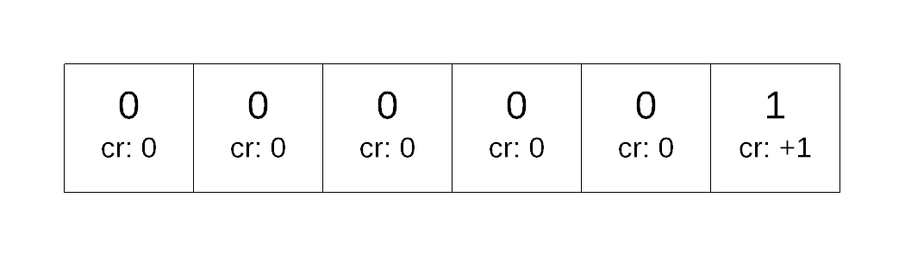
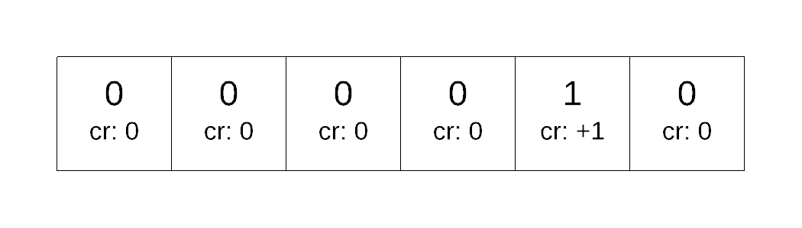
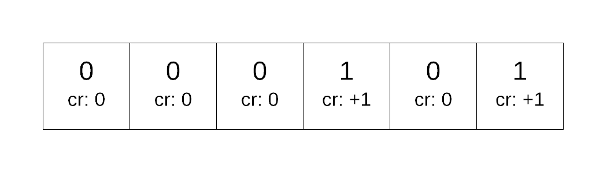
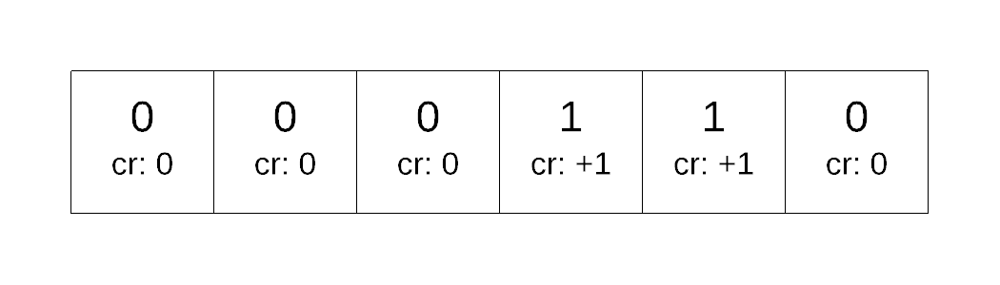
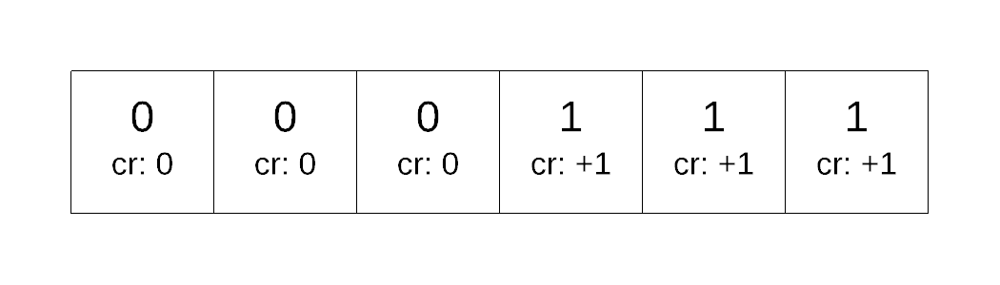
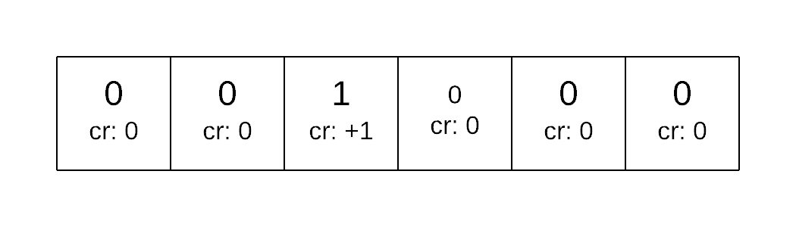

# Accounting Method

The accounting method effectively charges for each operation, storing up credits so that later it can be used to pay for future operations.  Note that the accounting method is just a different way to perform an amortized analysis.  It may not be as initially intuitive as the aggregate method, it can actually be a bit easier to understand.

What we do, is charge some amount for each operation.  Some of that charge is used to perform an operation, some of it is saved up for later.  Sort of like putting money away for a future expense. 

For each operation we assign a cost for the operation which represents the worst case running time.  We also assign a charge for the operation which represents the amortized worst case run time.   What we want to do is ensure that the total charge for the sequence &gt;= total cost for the sequence.  If the cost is less than the charge then we store what is left into the data stucture as credits.  If the cost is more, we pay for the operation with the credits that are stored up.  During this process we do not allow the credits to ever go negative \(ie you can't go into debt\).  If the total cost for the sequence &lt;= total charge of the sequence then the amortized complexity &lt;= average charge.

### Example 1: Binary Counter

Lets take a look at the bit flipping example a slightly different way:

| Operation | value | counter | comment about bit change |
| :--- | :--- | :--- | :--- |
| Initial | 0 | 00 0000 |  |
| increment\(\) | 1 | 00 000**1** | 0 --&gt; 1 1 times |
| increment\(\) | 2 | 00 00**10** | 0--&gt;1 1 times ,  1--&gt;0 1 times |
| increment\(\) | 3 | 00 001**1** | 0 --&gt;1 1 times |
| increment\(\) | 4 | 00 0**100** | 0--&gt;1 1 times, 1--&gt;0 2 times |
| increment\(\) | 5 | 00 010**1** | 0--&gt; 1 1 times |
| increment\(\) | 6 | 00 01**10** | 0--&gt; 1  1 times, 1--&gt;0 1 times |
| increment\(\) | 7 | 00 011**1** | 0--&gt;1 1 times |
| increment\(\)  | 8  | 00 **1000** | 0--&gt;1 1 times, 1--&gt; 0 3 times |

Every time we do an increment\(\) operation, 1 bit will always change from 0 to 1.  It is exactly 1 bit every time. \(with exception of when every bit is a 1 and we flip back to 0\)  all other bit changes go from 1 to 0.  So what we want to do is see if its possible to pay in advance to flip a bit back to 0 after it got changed to a 1.

We imagine storing the charges with each bit \(think of it as storing it up to change that particular bit back to a 0.

Now lets consider what would happen as we call increment

| Operation | Charge | Cost | What is stored | Credit balance  after operation |
| :--- | :--- | :--- | :--- | :--- |
| Initial | - | - |   | 0 |
| increment\(\) | +2 | 1 |   | +1 |
| increment\(\) | +2 | 2 |   | +1 |
| increment\(\) | +2 | 1 |   | +2 |
| increment\(\) | +2 | 3 |   | +1 |
| increment\(\) | +2 | 1 |   | +2 |
| increment\(\) | +2 | 2 |  | +2 |
| increment\(\) | +2 | 1 |  | +3 |
| increment\(\) | +2 | 4 |  | +1 |

During the process above, any bit that is a 1 will have a credit of 1 that can be used to flip back to a 0.

We can prove the above statement is true by induction.  

* We know that the statement is true initially as every single bit is a 0.
* We assume that the statement true, that every bit that has a 1 has a credit.  
* We then apply the increment\(\) operator to the counter.  This increment operator will always change exactly 1 bit from 0 to 1, charge two, store 1 into that bit.  All other bits that were 0 will not change so they have no cost.  For any other 1 bit, there is is  credit to change it back to 0.

### Example 2: Dynamic Array

Consider a the implementation of an array with two basic operations:

* append\(x\) - adds x to first free spot
* delete\(\) - removes item from last occupied spot

\(see arraystack implementation in course repo\).

If we allocate too much space for this array, we waste space.  If we allocate too little space we run out.  Similar to hash table problem. Thus what we do is that after we fill up the array, create a new array with double the capacity, copy everything over 

Firstly, because only append\(x\) grows the array, we will look at only performing append\(x\) operations.  Using the accounting method, we want to charge some amount for each operation in order to pay for future operations.

Now, let us consider what happens as we create our array

