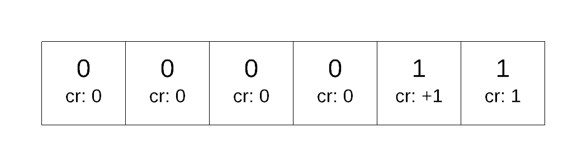
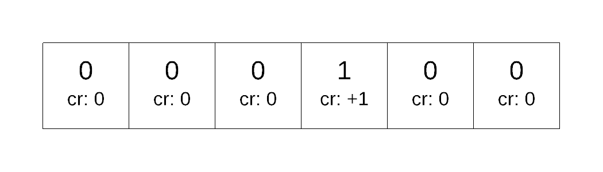

# Accounting Method

The accounting method effectively charges for each operation, storing up credits so that later it can be used to pay for future operations.  Note that the accounting method is just a different way to perform an amortized analysis.  It may not be as initially intuitive as the aggregate method, it can actually be a bit easier to understand.

What we do, is charge some amount for each operation.  Some of that charge is used to perform an operation, some of it is saved up for later.  Sort of like putting money away for a future expense. 

For each operation we assign a cost for the operation which represents the worst case running time.  We also assign a charge for the operation which represents the amortized worst case run time.   What we want to do is ensure that the total charge for the sequence &gt;= total cost for the sequence.  If the cost is less than the charge then we store what is left into the data stucture as credits.  If the cost is more, we pay for the operation with the credits that are stored up.  During this process we do not allow the credits to ever go negative \(ie you can't go into debt\).  If the total cost for the sequence &lt;= total charge of the sequence then the amortized complexity &lt;= average charge.

### Example 1: Binary Counter

Lets take a look at the bit flipping example a slightly different way:

| Operation | value | counter | comment about bit change |
| :--- | :--- | :--- | :--- |
| Initial | 0 | 00 0000 |  |
| increment\(\) | 1 | 00 000**1** | 0 --&gt; 1 1 times |
| increment\(\) | 2 | 00 00**10** | 0--&gt;1 1 times ,  1--&gt;0 1 times |
| increment\(\) | 3 | 00 001**1** | 0 --&gt;1 1 times |
| increment\(\) | 4 | 00 0**100** | 0--&gt;1 1 times, 1--&gt;0 2 times |
| increment\(\) | 5 | 00 010**1** | 0--&gt; 1 1 times |
| increment\(\) | 6 | 00 01**10** | 0--&gt; 1  1 times, 1--&gt;0 1 times |
| increment\(\) | 7 | 00 011**1** | 0--&gt;1 1 times |
| increment\(\)  | 8  | 00 **1000** | 0--&gt;1 1 times, 1--&gt; 0 3 times |

Every time we do an increment\(\) operation, 1 bit will always change from 0 to 1.  It is exactly 1 bit every time. \(with exception of when every bit is a 1 and we flip back to 0\)  all other bit changes go from 1 to 0.  So what we want to do is see if its possible to pay in advance to flip a bit back to 0 after it got changed to a 1.

We imagine storing the charges with each bit \(think of it as storing it up to change that particular bit back to a 0.

Now lets consider what would happen as we call increment

| Operation | Charge | Cost | What is stored | Credit balance  after operation |
| :--- | :--- | :--- | :--- | :--- |
| Initial | - | - |   | 0 |
| increment\(\) | +2 | 1 |   | +1 |
| increment\(\) | +2 | 2 |   | +1 |
| increment\(\) | +2 | 1 |   | +2 |
| increment\(\) | +2 | 3 |   | +1 |
| increment\(\) | +2 | 1 |   | +2 |
| increment\(\) | +2 | 2 |  | +2 |
| increment\(\) | +2 | 1 |  | +3 |
| increment\(\) | +2 | 4 |  | +1 |

During the process above, any bit that is a 1 will have a credit of 1 that can be used to flip back to a 0.

We can prove the above statement is true by induction.  

* We know that the statement is true initially as every single bit is a 0.
* We assume that the statement true, that every bit that has a 1 has a credit.  
* We then apply the increment\(\) operator to the counter.  This increment operator will always change exactly 1 bit from 0 to 1, charge two, store 1 into that bit.  All other bits that were 0 will not change so they have no cost.  For any other 1 bit, there is is  credit to change it back to 0.

### Example 2: Hash table resize

Going back to the hashtable resizing example:

```text
insert(x){
    if(loadFactor() >= 0.5){
        //grow
        create new table with double the capacity
        go through current table, for every non-nil element
           rehash into new table
    }
    hashidx=hashfunction(x.key);
    place x into table[hashidx], handle collision as needed
}
```

For our purposes lets assume that except for the code to grow the array, the rest of insertion\(\) is constant \(ie that our hash function will evenly distribute our data set evenly etc.\).

Using the accounting method, let us redo the analysis.  Lets start by simply charging $2 for each insertion operation.  That way we can use one to do the inserting and 1 to copy the element over when we grow.  Lets see if this work, using the same example as we had previously.  Any square that is filled is coloured blue.

<table>
  <thead>
    <tr>
      <th style="text-align:left">Operation</th>
      <th style="text-align:left">
        <p>loadfactor</p>
        <p>before insert()
          <br />call</p>
      </th>
      <th style="text-align:left">Charge</th>
      <th style="text-align:left">Cost</th>
      <th style="text-align:left">Hash table</th>
      <th style="text-align:left">Credit balance</th>
    </tr>
  </thead>
  <tbody>
    <tr>
      <td style="text-align:left">Initial</td>
      <td style="text-align:left">0</td>
      <td style="text-align:left">-</td>
      <td style="text-align:left">-</td>
      <td style="text-align:left">
        
      </td>
      <td style="text-align:left">0</td>
    </tr>
    <tr>
      <td style="text-align:left">insert()</td>
      <td style="text-align:left">0</td>
      <td style="text-align:left">2</td>
      <td style="text-align:left">1</td>
      <td style="text-align:left">
        
      </td>
      <td style="text-align:left">+1</td>
    </tr>
    <tr>
      <td style="text-align:left">insert()</td>
      <td style="text-align:left">0.5</td>
      <td style="text-align:left">2</td>
      <td style="text-align:left">3 (2 for growing, 1 for hashing new record)</td>
      <td style="text-align:left">
        
      </td>
      <td style="text-align:left">0</td>
    </tr>
  </tbody>
</table>Already we see that there is a problem after just one doubling.  There are two issues:

1. when we copy, we have to iterate over the empty elements to recognize they are empty 
2. After we copy, the element that we copied over used up the stored credit so in the future if we were to copy again, we won't have a credit to copy it.

So what should we do in this case?  Well, what we need to do is simply charge more for insertion than just $2 like we did with bit flipping.

So, firstly we duplicate when ever we get to half full.  Thus it makes sense that we need at least 1 more dollar to copy the empties.  The number of empties will be at most the same as the number of fulls so if each element had two credits then it can pay for dealing with the empty ones.

But this won't address the problem of not having the credits needed after a single copy for future copies.  Thus we will add $2 more dollars to charge \(5 dollars total\).  We double the array every time it reaches half full.  We want to ensure that the items added after we do a grow can pay for copying everything 

<table>
  <thead>
    <tr>
      <th style="text-align:left">Operation</th>
      <th style="text-align:left">
        <p>loadfactor</p>
        <p>before insert()
          <br />call</p>
      </th>
      <th style="text-align:left">Charge</th>
      <th style="text-align:left">Cost</th>
      <th style="text-align:left">Hash table</th>
      <th style="text-align:left">Credit balance</th>
    </tr>
  </thead>
  <tbody>
    <tr>
      <td style="text-align:left">Initial</td>
      <td style="text-align:left">0</td>
      <td style="text-align:left">-</td>
      <td style="text-align:left">-</td>
      <td style="text-align:left">
        
      </td>
      <td style="text-align:left">0</td>
    </tr>
    <tr>
      <td style="text-align:left">insert()</td>
      <td style="text-align:left">0</td>
      <td style="text-align:left">5</td>
      <td style="text-align:left">1</td>
      <td style="text-align:left">
        
      </td>
      <td style="text-align:left">+4</td>
    </tr>
    <tr>
      <td style="text-align:left">insert()</td>
      <td style="text-align:left">0.5</td>
      <td style="text-align:left">5</td>
      <td style="text-align:left">3</td>
      <td style="text-align:left">
        
      </td>
      <td style="text-align:left">+6</td>
    </tr>
    <tr>
      <td style="text-align:left">insert()</td>
      <td style="text-align:left">0.25</td>
      <td style="text-align:left">5</td>
      <td style="text-align:left">5</td>
      <td style="text-align:left">
        
      </td>
      <td style="text-align:left">+ 6</td>
    </tr>
    <tr>
      <td style="text-align:left">insert()</td>
      <td style="text-align:left">0.375</td>
      <td style="text-align:left">5</td>
      <td style="text-align:left">1</td>
      <td style="text-align:left">
        
      </td>
      <td style="text-align:left">+ 10</td>
    </tr>
    <tr>
      <td style="text-align:left">insert()</td>
      <td style="text-align:left">0.5</td>
      <td style="text-align:left">5</td>
      <td style="text-align:left">9</td>
      <td style="text-align:left">array has 16 elements, 8 of the credits from before was used, leaving
        a single new element with 4 credits</td>
      <td style="text-align:left">+6</td>
    </tr>
  </tbody>
</table>As we can see, the number of credits we add with each insertion after a grow operation is enough to pay for the duplication of every element of the array even if the rest of the array has no credits.

Thus, the total number cost for m operation is 5 m.  Therefore the amortized cost per operation is 5m/m and thus, the run time is constant.


