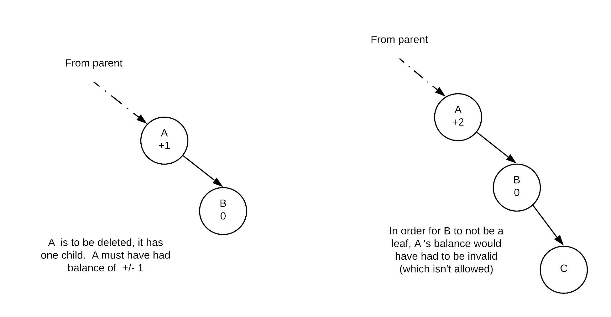
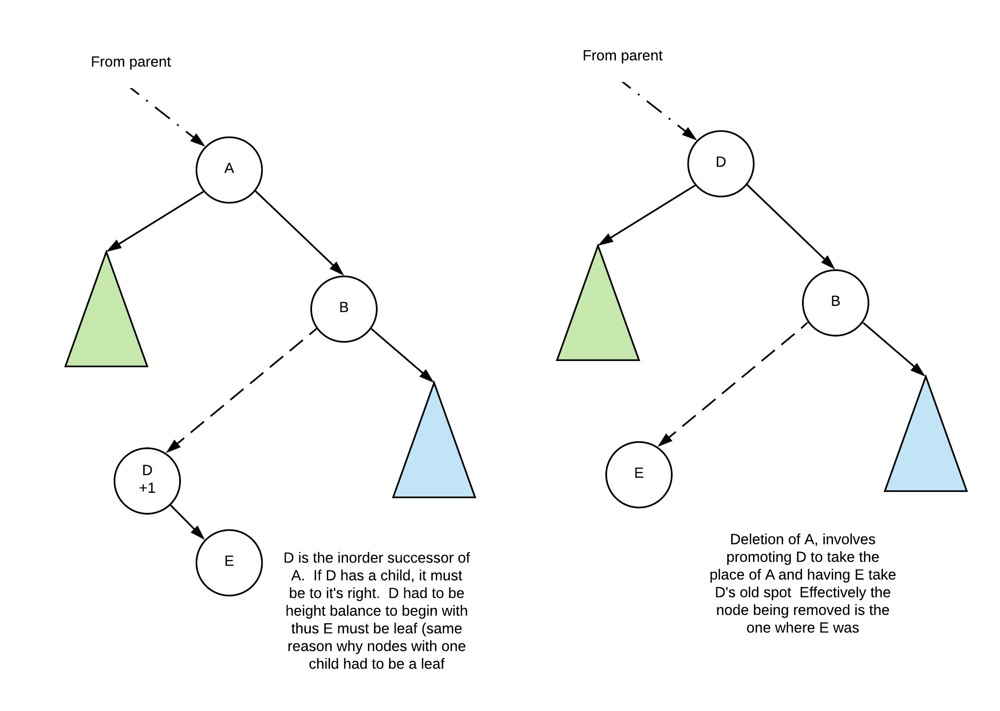
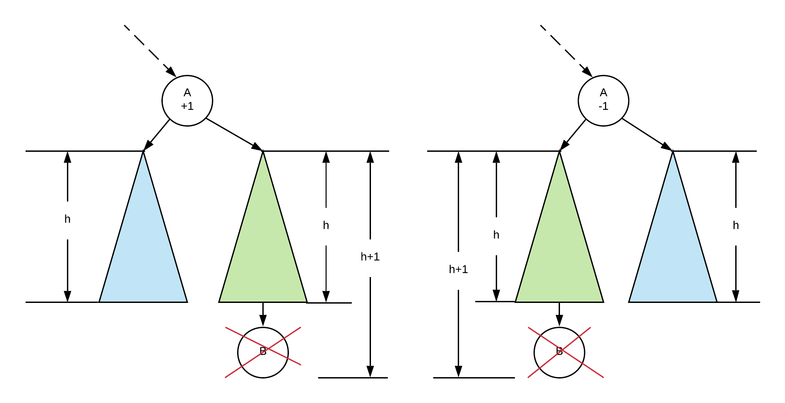
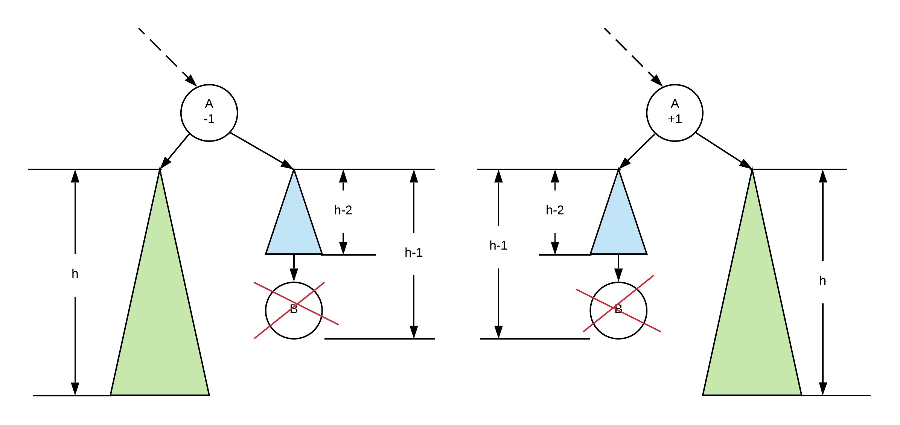

# AVL Trees

A tree is perfectly balanced if it is empty or the number of nodes in each subtree differ by no more than 1. In a perfectly balanced tree, we know that searching either the left or right subtree from any point will take the same amount of time.

The search time in a perfectly balanced tree is O\(log n\) as the number of nodes left to consider is effectively halved with each node considered. However, to get a tree to be perfectly balance can require changing every node in the tree. This makes trying to create a perfectly balanced tree impractical.

An AVL tree does not create a perfectly balanced binary search trees. Instead it creates a _**height balanced**_ binary search trees. A height balanced tree is either empty or the height of the left and right subtrees differ by no more than 1. A height balanced tree is at most 44% taller than a perfectly balanced tree and thus, a search through a height balanced tree is O\(log n\). Insert and delete can also be done in O\(log n\) time.

## Height Balance

AVL trees work by ensuring that the tree is height balanced after an operation. If we were to have to calculate the height of a tree from any node, we would have to traverse its two subtrees making this impractical \(O\(s\) where s is number of nodes in the subtree\). Instead, we store the height information of every subtree in its node.   This value can then be used to calculate the nodes balance factor.  Thus, each node must not only maintain its data and children information, but also information needed to calculate the Balance Factor..

The balance factor of a node is calculated as follows:

```text
Balance Factor = height of right - height of left
     of node       subtree             subtree
```

The above formula means that if the right subtree is taller, the balance factorof the node will be positive. If the left subtree is taller, the balance of the node will be negative.


## Insertion <a id="insertion"></a>

Insertion in AVL tree is starts out similar to regular binary search trees. That is we do the following:

* Find the appropriate empty subtree where new value should go by comparing with values in the tree.
* Create a new node at that empty subtree.
* New node is a leaf and thus will have a balance factor of 0
* go back to the parent
* If the balance factor of a node is ever more than 1 or less than -1, the subtree at that node will have to go through a rotation in order to fix the balance factor. The process continues until we are back to the root.
* NOTE: The adjustment must happen from the bottom up

### Example <a id="example"></a>

Suppose we have start with the following tree \(value on top is the value, value on bottom is the balance factor


#### Insert 30 <a id="insert-30"></a>

At this point, we have adjusted all the balance factors along the insertion path and we note that the root node has a balance factor of 2 which means the tree is not height balanced at the root.

In order to fix our tree, we will need to perform a rotation


#### Insert 27 <a id="insert-27"></a>

We start with our tree:


Now we find the correct place in the tree and insert the new node and fix the balance factors


Now, as we reach node 25 and see that it the balance factor is +2. If we then look at it's child's balance factor we find that it is -1. As the signs are different, it indicates that we need a double rotation. Different signs indicate that the unbalance is in different directions so we need to do a rotation to make it the same direction then another to fix the unbalance.


## Why does it work?

This section considers why AVL tree rotations fixes the trees for insertions

### Single Rotation

We always fix nodes starting from the insertion point back to the root. Thus, any node in the insertion path further towards leaf nodes must already be fixed.  We draw these trees as triangles and we can assume that they are proper AVL Trees

Consider the following idea of what an AVL tree looks like:


In this diagram, we have two nodes A and B and we see their balance factor. We know that the subtrees X, Y and Z are valid AVL trees because they would have been fixed as we process our tree back to the root.

From here we also know that:

```text
all values  <  A  <  all values  <  B  <  all values
in X                     in Y                in Z
```

While we don't know how tall X, Y and Z are, we know their relative heights because we know the balance factor

Thus, if X has a height of h, B must be h+2 tall because the balance factor at A is +2. This means that the right subtree at B is 2 taller than A.

Continuing on, we know that Z is the taller of the two subtrees of B because the balance factor is +1, and thus Z must be h+1 tall while Y must be h tall.

A rotation repositions B as the root of the tree, makes node A the left child of B. Make X the right child of A.

Given that X, Y and Z are unchanged, the balance factor at A and B will become 0.


The mirror of the above is true for single left rotation

### Double Rotations

A similar explanation of why double rotations work can be reasoned out by looking at the following tree:


We know that W, X, Y and Z are all valid avl trees. We also know the following about the values in each of the trees and nodes

```text
all              all               all          all
values  <  A  <  values  <  C  <  values < B <  values
in W              in X             in Y          in Z
```

Now... we know the balance factor of A and B \(off balance node and child\) we do not know the exact balance factor of C. However, we do know that it is a valid avl tree, so C's balance factor must be either -1, 0 or +1.

So, if C's balance factor is 0, then both x and y will have height of h.

if C's balance factor is +1 then y will be h and x would be h-1

if C's balance factor is -1 then x would be h and y would h-1

Perform a double rotation:


After the rotation is completed, notice that the position of the subtrees W,X, Y and Z along with the nodes A, B and C are placed in a way where their ordering is properly maintained.

Furthermore, The balance factor of C becomes 0 regardless of what it was initially. The final balance factor of A and B depends on what the original balance factor of C was:

| original balance factor of C | height of X | height of Y | final balance factor of A | final balance factor of B |
| :--- | :--- | :--- | :--- | :--- |
| -1 | h | h-1 | 0 | +1 |
| 0 | h | h | 0 | 0 |
| +1 | h-1 | h | -1 | 0 |

## Deletion

The deletion algorithm for AVL trees must also keep the tree height balanced.  This section will look at how deletion works.

The deletion algorithm does the following:

* In general follow BST deletion rules.
  * if node is leaf delete node, set pointer from parent to nullptr
  * if node has one child, have parent point to only child
  * if node has two children replace deleted node with inorder successor
* Because a deletion could potentially shorten a tree, we might need to adjust the tree.  Starting with the deleted node \(which may not actually be the node that contains the value we are getting rid of... more on this later\) work our way back up to root, fix the height/balance info and rotate as needed.

The rest of this section will look at how it works

### Deletion always removes a leaf node

The above statement may seem a bit odd because it seems like it can't be true, but it is.    Note that node being remove isn't necessarily the node where value being removed was originally found. Lets consider the three deletion cases to explain why it is true:

#### Value is found in a leaf node

In this case, clearly the node to be removed is a leaf as we found it there.  Thus, we get rid of it, adjust or height/balance values going back up the tree

#### Value is in a node with exactly one child

A node with only one child means that the only child is a leaf.  The reason for this is because our tree is height balanced to start with.  If the only child had a child, the node wouldn't have been height balanced as illustrated in the following diagram:



Thus, what effectively happens is that we end up with a tree that is shaped like we were removing B

#### Value is in a node with exactly two children

The algorithm to remove a node with two children is to replace the node with its inorder successor node.  This node is found by going one node to the right then going left until you can't.  The inorder successor itself can only have a right child \(if it had a left child it wouldn't be the inorder successor\).  As with the case of nodes with only one child, the inorder sucessor's right child must be a leaf because the inorder successor must have been height balanced before the deletion operation.



### Fixing the tree

When will we need to fix the tree?

Clearly if the deletion doesn't shorten its subtree, there is nothing that needs to be done. 

Thus, we only need to consider what happens if deleting the node causes the tree to shorten.

Let us consider the following.  In each case, B is the node being removed, A is some node along the path to B

#### Balance of node was 0

In the above, the A has balance of 0.  Removing B, shortened the blue subtree.  However, as the balance was 0 at A, A's balance will simply go either to +/- 1.   No rotation needed.  Also not only was no rotation needed, the height of the tree at A is actually exactly the same as it was before the deletion and thus, we can stop fixing the tree as nodes further up will not be affected


#### Balance of node was 1

Two things can occur.  In the first case our node comes from the taller of the subtrees tree and it causes the tree to shorten.



if that is the case then we do not have to do any rotations at A because A's balance will become 0.  However, the tree did get shorter, so we must continue going up the tree as other nodes further up may require a rotation

The second case is when we take out a node from the shorter subtree:



If we did this then our balance will go to +/- 2.  This would require rebalancing.  Like an insertion, rebalancing is simply a matter of applying a single or double rotation.  We simply need to follow the same rules and perform the rotation.

After a rebalancing a node the subtree might have become shorter than it was because of the rotation, and thus we may need to go further up the tree to fix it.


