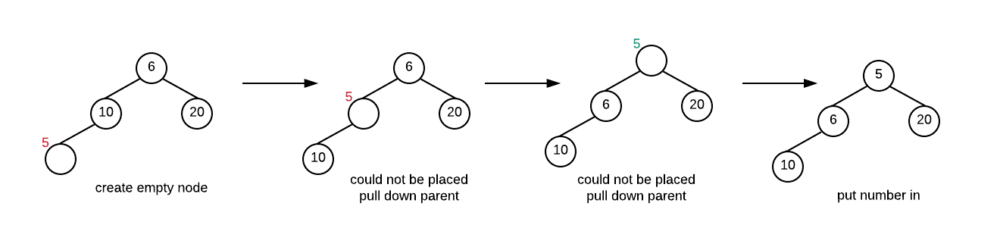
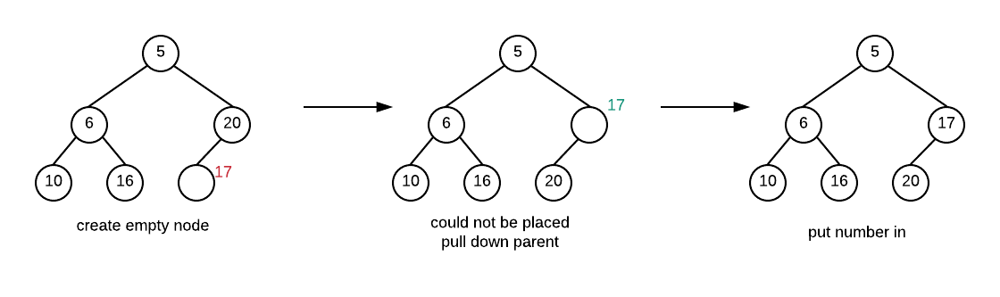
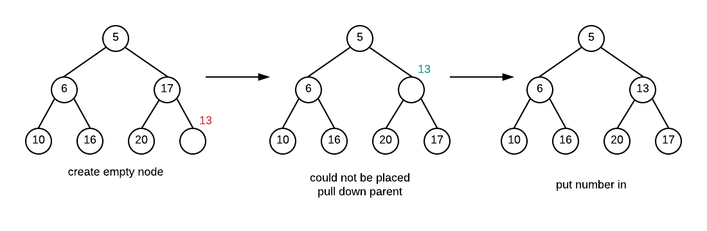

# Binary Heap

The binary heap is a data structure that can be used to implementation of a _**Priority Queue**_**.** Normally, when you have a queue, the first value in is the first value out. However with a priority Queue the value that comes out of the queue next depends on the priority of that value.

Basic operations on the binary Heap include:

* insert - add an item to the binary heap
* delete - removes the item with the highest priority in the binary heap.
* heapify - forms a heap from an array of values that are not organized in any way.

A priority queue is an abstract data type.  Like queues and stacks, it is an idea, the underlying storage and access is decoupled from the functionality of a priority queue.  A priority queue is similar to a queue in that you use it for ordering data. However, instead of ordering based on when something was added, you order it based on the priority value of the item.  An item at the front of the priority queue \(and the item that will be removed if an item is to be dequeued\)  is the item with the highest priority.  This is the type of queues you might find in a hospital emergency room.  The thing that matters more is the severity of the illness as opposed to who got there first. 

If you were to implement a priority queue using a regular list, you would essentially have to maintain a sorted list \(sorted by priority\). This would mean the following:

1. insertions would be O\(n\) for sure as you would need to go through an already sorted list trying to find the right place then doing the insertion.
2. removal is from the "front" of the queue, so depending on how you do your implementation, this can be potentially O\(n\) also.

This is not very efficient. If we were to create our priority queue in this manner the run time for both operations would not be very good.  If we then base a sort on such a data structure, its run time would be no better than one of the simple sorts.  Thus, clearly this isn't how we should implement a priority queue.

The interesting thing about a priority queue is that we really don't care where any value other than the one with the highest priority is. We care about where the highest priority item is and we want to be able to find it and remove it quickly but all other values can be essentially anywhere.

A binary heap is a data structure that can help us achieve this.

## Binary Heap - Basic Definitions

Before we begin, the definitions below look involves trees. It may be a good idea to look at those definitions first so that the definitions with respect to heaps make more sense.

**Binary Heap** - A binary heap is a **complete binary tree** where the **heap order property** is always maintained.

**Binary Tree** - A binary tree is either a\) empty \(no nodes\), or b\) contains a root node with two children which are both binary trees.

**Complete Binary Tree** - A binary tree where there are no missing nodes in all except at the bottom level. At the bottom level the missing nodes must be to the right of all other nodes

These binary trees are complete.

These binary trees are not complete. The first one is missing a node one level higher than leaves, the second is missing further left in the tree than an existing node

**Heap Order Property**: For each node, the parent of the node must have a higher priority, while its children must have a lower priority. There is no ordering of priority other than this rule. Thus, the highest priority item will be at the root of the tree. 

Below is a heap where we define the smaller value \(aka MinHeap\) as having higher priority:

## Binary Heap - Insertion

Insertion into a heap must maintain both the complete binary tree structure and the heap order property. To do this what we do is the following.

* create a new empty node in the left most open spot at the bottom level of the tree
* If value can be placed into node without violating heap order property put it in
* otherwise pull the value from parent into the empty node
* repeat the previous two steps until the value can be placed

This process effectively creates an empty node starting at the bottom of the tree. The empty node moves up until it is in the correct position and the value can be placed inside the empty node. This process of moving the empty node towards the root is called _**percolate up**_

### **Example**

Create a heap by inserting these number in the order given: 10, 6, 20, 5, 16, 17, 13, 2

#### **Insert 10**

#### Insert 6

#### Insert 20

#### Insert 5

#### Insert 16

#### Insert 17

Insert 13

#### Insert 2

