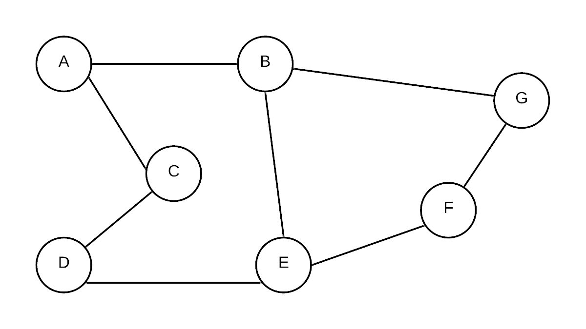

# Graphs

A Graph $$G=(V,E)$$ is made up made of a set of vertices $$V={v_1, v_2, v_3...}$$ and edges $$E ={e_1,e_2, e_3...}$$. Each edge in $$E$$ defines a connection between $$(u,v)$$, where $$u,v \in V$$

Here is a drawing of a graph:

 

This graph has vertices A, B, C, D, E, F and G.  Note that these are really just labels that can be used to refer to the vertices... in reality we don't necessarily store labels in this manner.  Often vertices are just numbered

Edges can also have weights

  

The weights on an edge can act in a way to serve as information about the nature of the connection between two vertices.  For example, each vertex can represent a city and the weights, the distance between the cities.

Aside for weights, an edge may also include a direction.  Graphs where edges have directions are also called a digraph

## Representation 

To store the info about a graph, there are two general approaches.

* Adjacency list
* Adjacency matrix

These can each have its own advantages and disadvantages.

### Adjacency Matrix

An adjacency matrix is in essence a 2 dimensional array. Each index value represents a node. When given 2 nodes, you can find out whether or not they are connected by simply checking if the value in corresponding array element is 0 or not. For graphs without weights, 1 represents a connection. 0 represents a non-connection.

Weights on edges can be stored by replacing the 1 with the weight

Directions can be stored by designating one index as _**from**_ and one index as _**to**_

The advantage of an adjacency matrix is that it is a simple representation.  It is also capable of answering the question "is vertex U connected to vertex V?" very quickly $$\theta(1)$$.  Similarly it is also very fast at finding the weight on the edge between two vertices.  

The disadvantages however are this... unless every vertex is connected to nearly every other vertex, most of the entries in the graph will be 0s.  The storage needed for an adjacency matrix is $$|V|^2$$.  Furthermore, while the adjacency matrix answers the question "is vertex U connected to vertex V?" very quickly.  It cannot answer the question "what vertices are connected to vertex V" quickly.  It must travel along an entire row of the 2D array to look for non-zero values, thus the run time is $$\theta(|V|)$$

### Adjacency List:

An adjacency list is an array of linked lists.  For each vertex in G, create of vertices that can be reached by following just one edge

This is a much more compact way to represent a graph.  It is especially good if there are many vertices and few edges coming from each vertex.

An adjacency matrix represents a graph using a 2D array.  Each index value represents a specific vertex.  The existence of an edge between two vertices is represented as a 1 for unweighted graphs and the weight for weighted graphs.  For directed graphs, we use one index to represent the vertice the edge starts at at and the other for where it is going.

The advantage of an adjacency matrix is that it is very fast in finding if there is an edge or the weight of the edge between two vertices u and v.  There are two main disadvantages of this presentation.  The first is storage... the amount of storage needed is $$O(|V|^2)$$ Often graphs have many vertices with relatively fewer edges.  Most of the values in the array would thus be 0.  Furthermore, while the question of whether or not two vertices are connected is very fast to find using the adjacency matrix representation, finding the list of the vertices connected to a given vertex is much slower $$O(|V|)$$.  

### Adjacency List

An adjacency matrix represents a graph as an array of linked lists.  The index of each element of the array represents a vertex.  Each node of the linked list stores a vertex representing an edge between the vertex of the array element and the vertex in the node.

The advantage of an adjacency list is that finding the list of the vertices connected to a given vertex is simply the number of vertices connected to the given vertex \(we don't have to look at any vertex that isn't connected\).  

### Adjacency Matrix:

