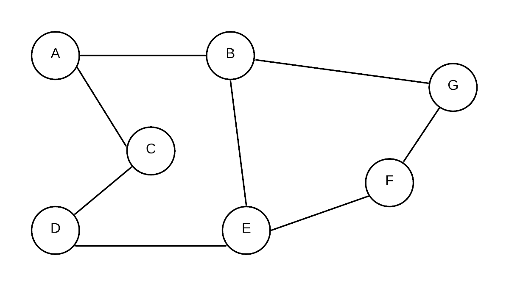
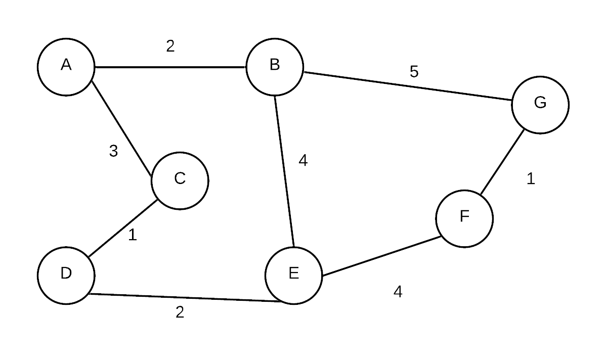
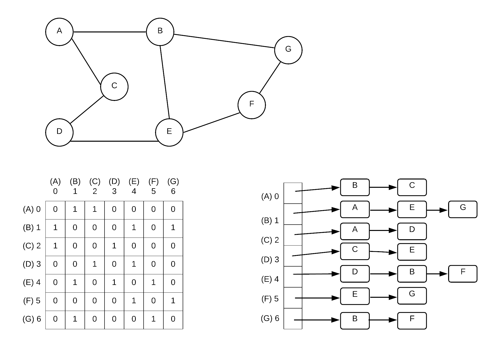
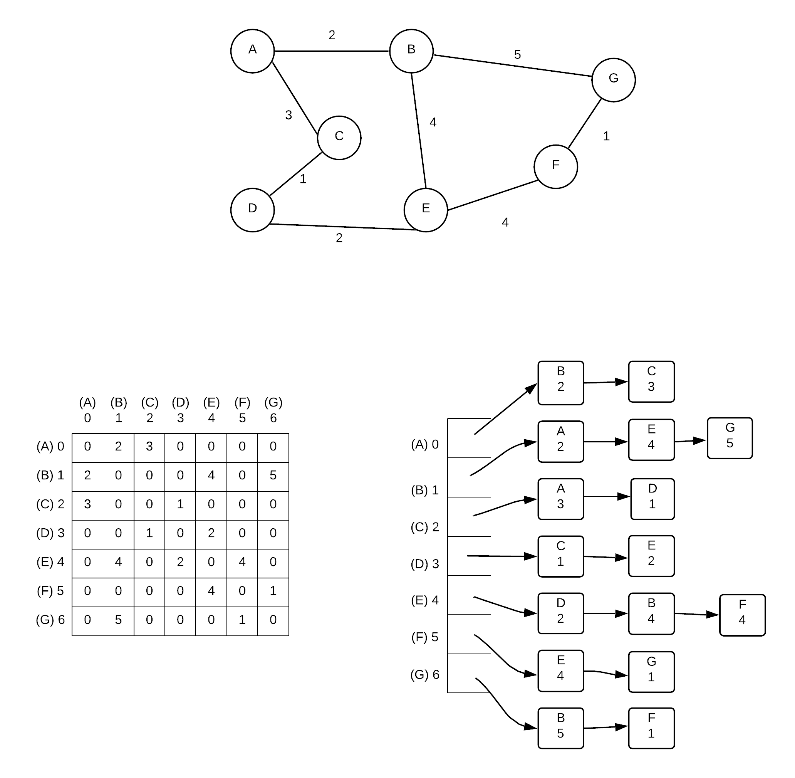
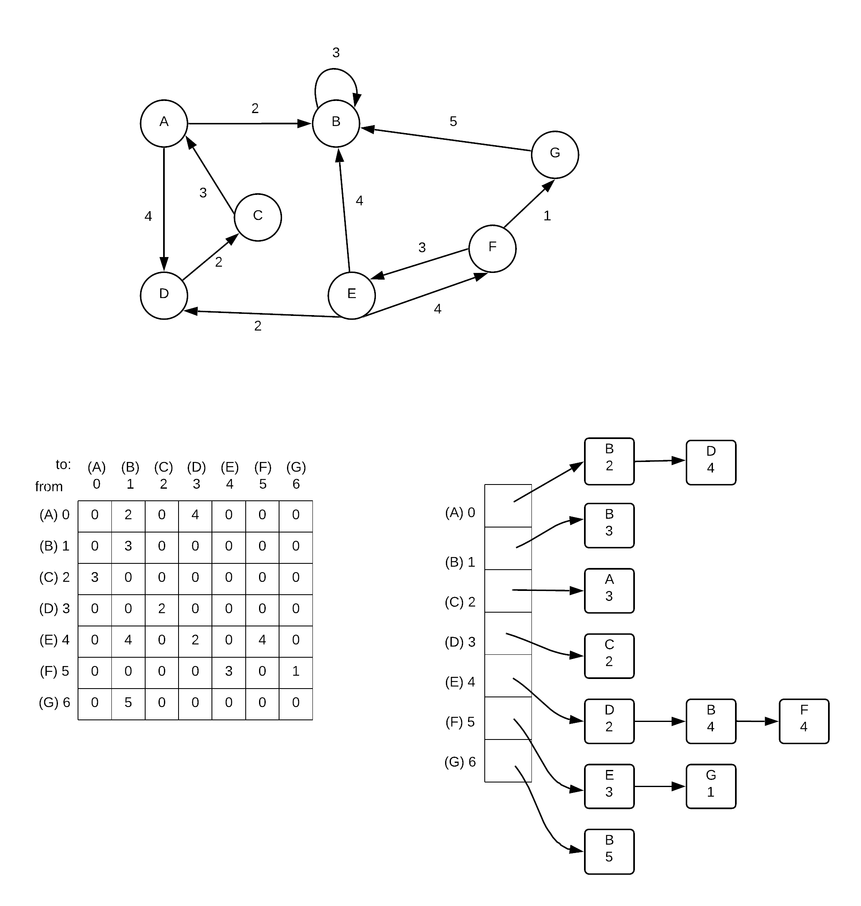

# Graphs

A Graph $$G=(V,E)$$ is made up made of a set of vertices $$V={v_1, v_2, v_3...}$$ and edges $$E ={e_1,e_2, e_3...}$$. Each edge in $$E$$ defines a connection between $$(u,v)$$, where $$u,v \in V$$

Here is a drawing of a graph:

 

This graph has vertices A, B, C, D, E, F and G.


Note that the vertex labels A,B,C etc. are just labels.  These labels are used to refer to the vertices in the diagram... in reality we don't necessarily store/name labels in this manner.  Often vertices are just identified by a number or has some other identifying feature. 


Edges can also have weights  

The weights on an edge can act in a way to serve as information about the nature of the connection between two vertices.  For example, each vertex can represent a city and the weights, the distance between the cities.

Aside for weights, an edge may also include a direction.  Graphs where edges have directions are also called a digraph

## Representation 

To store the info about a graph, there are two general approaches.

* Adjacency list
* Adjacency matrix

These can each have its own advantages and disadvantages.

### Adjacency Matrix

An adjacency matrix is in essence a 2 dimensional array. Each index value represents a node. When given 2 nodes, you can find out whether or not they are connected by simply checking if the value in corresponding array element is 0 or not. For graphs without weights, 1 represents a connection. 0 represents a non-connection.

Weights on edges can be stored by replacing the 1 with the weight

Directions can be stored by designating one index as _**from**_ and one index as _**to.**_   Typically, array\[from\]\[to\] is marked as 1 if there is an edge from $$ v_{from}$$to $$v_{to}$$.  

The advantage of an adjacency matrix is that it is a simple representation.  It is also capable of answering the question "is vertex $$u$$ connected to vertex $$v$$?"  or in the case of a directed graph "is there an edge from vertex $$u$$ to vertex $$v$$?" very quickly $$\theta(1)$$.  Similarly it is also very fast at finding the weight on the edge between two vertices.  

The disadvantages however are this... unless every vertex is connected to nearly every other vertex, most of the entries in the graph will be 0s.  The storage needed for an adjacency matrix is $$|V|^2$$.  Furthermore, while the adjacency matrix answers the question "is vertex $$u$$ connected to vertex $$v$$?" very quickly.  It cannot answer the question "what vertices are connected to vertex $$u$$?" nearly as quickly.  It must travel along an entire row for vertex$$u$$of the 2D array to look for non-zero values, thus the run time is $$\theta(|V|)$$.  

### Adjacency List:

An adjacency list is an array of linked lists.  For each vertex in G, create a linked list of vertices that can be reached by following just one edge

This is a much more compact way to represent a graph.  It is especially good if there are many vertices and few edges coming from each vertex.

An adjacency list uses less storage to store a graph if there are many vertices with few edges for each vertex.

An adjacency list is not as fast at answering the question "Is $$u$$ connected to $$v$$?" as quickly as an adjacency matrix.  To answer that question, you would need to go to the linked list at the index for $$u$$then go through the link list looking for $$v$$.  The more edges $$u$$have, the longer it takes to determine if there is an edge to $$v$$. 

An adjacency list is good at answering the question "what vertices are connected to vertex $$u$$?".  Essentially the entire linked list at $$u$$ is the answer.  

###  Examples

These diagrams provide a visual example of graph representations

