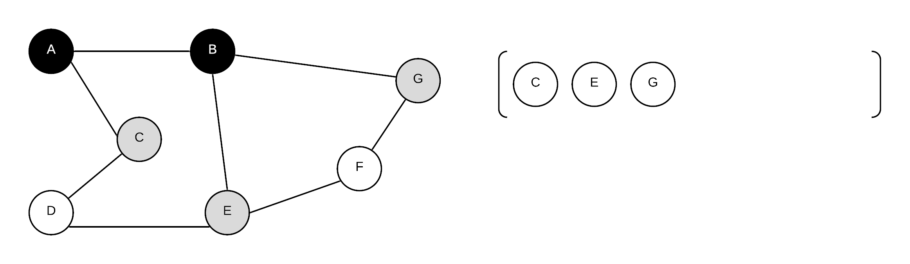
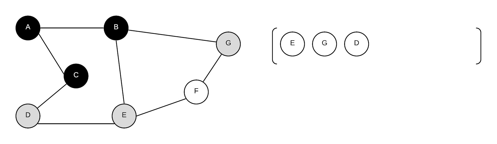

# Breadth-first Search

Breadth-first search \(BFS\) is a method of traversing a graph $$G=(V,E)$$ starting from a source $$ s \in V $$.   BFS starts from a source vertex $$s$$.  It will then _**visits**_ every vertex $$v$$ reachable from $$s$$  forming a BFS tree and thus finding paths from $$s$$ to $$v$$.  BFS visits nodes in order based on its distance from $$s$$.  That is, it will first visit all vertices that are directly connected to s then vertices that are two vertices away and so on.

To perform a BFS on a graph, we keep track of the status of each vertex with a colour:

* white - vertex is not yet discovered in any way
* grey - vertex is encountered but not yet explored
* black - vertex is explored

How these colour come into play will be clear once we look at the algorithm.

Other than the colour, each vertex also tracks its previous vertex and the distance from $$s$$

### Basic BFS Algorithm

To support a breadthfirst search, we will use a _**queue**_.  Recall that a queue is a FIFO data structure that supports 

* enqueue\(x\)  - adds x to the queue
* dequeue\(\) - removes oldest item from queue
* front\(\) - returns oldest item in the queue
* isEmpty\(\) - returns true if queue is empty

```cpp
BFS(G = (V,E), s){
    Queue q;
    for every vertex v in V{
        colour[v]=white;
        distance[v]=infinity;
        pi[v] = NIL
    }
    colour[s]=grey;
    distance[s]=0;
    q.enqueue(v);
    while(!q.isEmpty()){
        curr=q.front();
        q.dequeue();
        for(each edge (curr,v) of curr){
            if(colour[v] == white){
                distance[v]=distance[curr]+1;
                pi[v]=curr;
                colour[v]=grey;
                q.enqueue(v);
            }
        }
        colour[curr]=black;
    }
```

We are going to look at how a breadthfirst search will work using the following graph, starting using vertex A as our starting point.  the graph's adjacency matrix and adjacency list are also shown.


All above operations can be implemented with an O\(1\) runtime with either array or linked list. 

#### Initial:

| Vertex | Distance | $$pi$$ | colour |
| :--- | :--- | :--- | :--- |
| A | $$\infty$$ | NIL | white |
| B | $$\infty$$ | NIL | white |
| C | $$\infty$$ | NIL | white |
| D | $$\infty$$ | NIL | white |
| E | $$\infty$$ | NIL | white |
| F | $$\infty$$ | NIL | white |
| G | $$\infty$$ | NIL | white |


#### Step 1:

Start with the starting vertex A, enqueue it to prime the loop

| Vertex | Distance | $$pi$$ | colour |
| :--- | :--- | :--- | :--- |
| A | 0 | NIL | grey |
| B | $$\infty$$ | NIL | white |
| C | $$\infty$$ | NIL | white |
| D | $$\infty$$ | NIL | white |
| E | $$\infty$$ | NIL | white |
| F | $$\infty$$ | NIL | white |
| G | $$\infty$$ | NIL | white |


#### Step 2:

Enqueue the B and C as there is an edge from A to B and from A to C.  At this point, A is now black because it is explored.  B and C are encountered because we have looked at them, who their previous is as well as their distance to starting point

| Vertex | Distance | $$pi$$ | colour |
| :--- | :--- | :--- | :--- |
| A | 0 | NIL | black |
| B | 1 | A | grey |
| C | 1 | A | grey |
| D | $$\infty$$ | NIL | white |
| E | $$\infty$$ | NIL | white |
| F | $$\infty$$ | NIL | white |
| G | $$\infty$$ | NIL | white |


#### Step 3

Continue by removing vertex at front of queue and process the edges from that vertex.  Thus, remove B, enqueue G and E \(but not A because it is no longer coloured white\) updating distance and pi values for G and E.  As they are now encountered they are coloured grey.  Make B black as it is now explored

| Vertex | Distance | $$pi$$ | colour |
| :--- | :--- | :--- | :--- |
| A | 0 | NIL | black |
| B | 1 | A | black |
| C | 1 | A | grey |
| D | $$\infty$$ | NIL | white |
| E | 2 | B | grey |
| F | $$\infty$$ | NIL | white |
| G | 2 | B | grey |



#### Step 4

Continue by removing vertex at front of queue and process the edges from that vertex.  Thus, remove C, enqueue D \(but not A because it is no longer coloured white\) updating distance and pi values for D.  As it is now encountered they are coloured grey. Make C black as it is now explored

| Vertex | Distance | $$pi$$ | colour |
| :--- | :--- | :--- | :--- |
| A | 0 | NIL | black |
| B | 1 | A | black |
| C | 1 | A | black |
| D | 2 | C | grey |
| E | 2 | B | grey |
| F | $$\infty$$ | NIL | white |
| G | 2 | B | grey |



#### Step 5

Continue by removing vertex at front of queue and process the edges from that vertex.  Thus, remove E, enqueue F \(but not D or B because they are no longer coloured white\) updating distance and pi values for F.  As it is now encountered they are coloured grey. Make E black as it is now explored

| Vertex | Distance | $$pi$$ | colour |
| :--- | :--- | :--- | :--- |
| A | 0 | NIL | black |
| B | 1 | A | black |
| C | 1 | A | black |
| D | 2 | C | grey |
| E | 2 | B | black |
| F | 3 | E | grey |
| G | 2 | B | grey |

####  


#### Step 6

Remove G, nothing to enqueue as B and F are not white. Make G black as it is now explored

| Vertex | Distance | $$pi$$ | colour |
| :--- | :--- | :--- | :--- |
| A | 0 | NIL | black |
| B | 1 | A | black |
| C | 1 | A | black |
| D | 2 | C | grey |
| E | 2 | B | black |
| F | 3 | E | grey |
| G | 2 | B | black |


#### Step 7

Remove D, nothing to enqueue as C and E are not white. Make D black as it is now explored

| Vertex | Distance | $$pi$$ | colour |
| :--- | :--- | :--- | :--- |
| A | 0 | NIL | black |
| B | 1 | A | black |
| C | 1 | A | black |
| D | 2 | C | black |
| E | 2 | B | black |
| F | 3 | E | grey |
| G | 2 | B | black |


#### Step 8

dequeue F, nothing to enqueue as C and E are not white. Make D black as it is now explored

| Vertex | Distance | $$pi$$ | colour |
| :--- | :--- | :--- | :--- |
| A | 0 | NIL | black |
| B | 1 | A | black |
| C | 1 | A | black |
| D | 2 | C | black |
| E | 2 | B | black |
| F | 3 | E | black |
| G | 2 | B | black |


