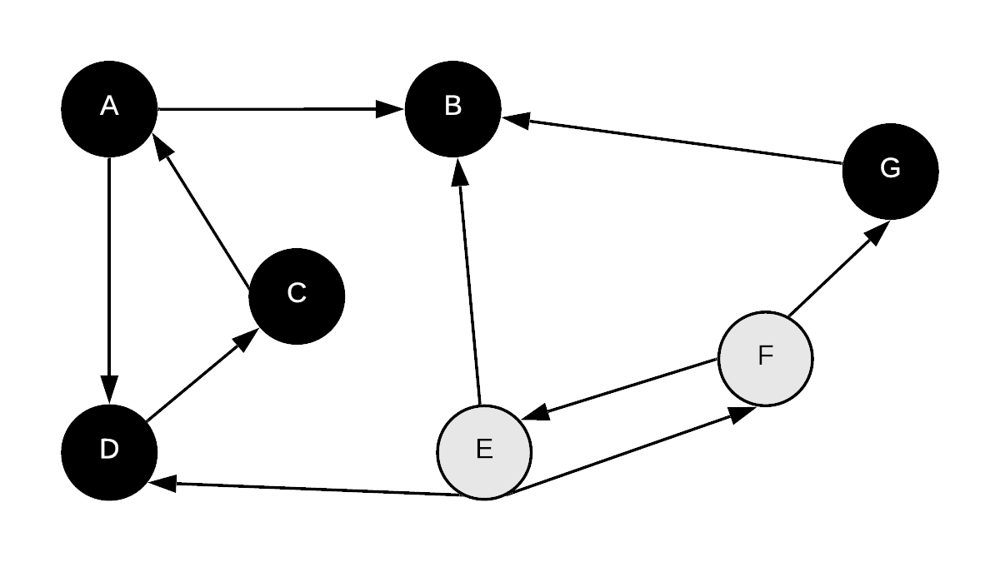

# Depth First Search

Depth first search is like a BFS in that it will traverse a graph. The difference is that instead of visiting the all nodes closest to$$s$$first, we follow a path as far as we can go before we backtrack.  Instead of tracking distance from s, we record a discovery/finish times.  This discovery/finish time can then be used to find various properties of a graph.

### Basic Depth First Search Algorithm

Similar to how a BFS works, to perform a DFS on a graph, we keep track of the status of each vertex with a colour:

* white - vertex is not yet discovered in any way
* grey - vertex is encountered but not yet visited
* black - vertex is explored

It is natural to write a depthfirst search recursively.  An alternative is to use a stack to track which nodes to visit next.

One of the applications of DFS is to be able to find connected components of a graph.  Thus, instead of just having a single starting node $$s$$.  We go through all unvisited vertices and  perform the DFS-Visit routine until every vertex is visited.  This method could also be used for BFS also.

```cpp
DFS(G=(V,E)){
    //global time
    currTime=0;
    
    //initialize results
    for(each vertex v in V){
        colour[v]=white;
        discoverTime[v]=infinity
        finishTime[v]=infinity;
        pi[v]=NIL;    
    }
    
    //for every unvisited vertex, preform a DFSVisit.
    //note that after it visits the first vertex, some of the other vertices could
    //have been visited as part of recursive call so while this loop runs for all 
    //v, only starting vertices that are in separate components would be
    //used as initial recursive starting point
    for(each vertex v in V){
        if(colour[v] == white){
            DFSVisit(G,v);
        }
    }
}

//performs a depthfirst search with s as starting vertex recursively
DFSVisit(G=(V,E), s){
    colour[s]=grey;
    currTime++;
    discoveryTime[s]=currTime;
    for(each edge (s,v) of s){
        if(colour[s]==white){
            pi[v]=s;
            DFSVisit(G,v);
        }
        colour[s]=black;
        currTime++;
        finishTime[s]=currTime;
    }
}
```

### Depth First Search Example

We will perform DFS on the following directed graph.


Initial values:

| Vertex | discovery time | finish time | pi | colour |
| :--- | :--- | :--- | :--- | :--- |
| A | $$\infty$$ | $$\infty$$ | NIL | white |
| B | $$\infty$$ | $$\infty$$ | NIL | white |
| C | $$\infty$$ | $$\infty$$ | NIL | white |
| D | $$\infty$$ | $$\infty$$ | NIL | white |
| E | $$\infty$$ | $$\infty$$ | NIL | white |
| F | $$\infty$$ | $$\infty$$ | NIL | white |
| G | $$\infty$$ | $$\infty$$ | NIL | white |

We begin our algorithm at vertex A \(will use alphabetical order to determine who is "next"

#### Step 1: 

Start with vertex A, mark it as grey, record its discovery time, then go through the nodes connected to it, starting at B

   
 

| Vertex | discovery time | finish time | pi | colour |
| :--- | :--- | :--- | :--- | :--- |
| A | **1** | $$\infty$$ | NIL | **grey** |
| B | $$\infty$$ | $$\infty$$ | NIL | white |
| C | $$\infty$$ | $$\infty$$ | NIL | white |
| D | $$\infty$$ | $$\infty$$ | NIL | white |
| E | $$\infty$$ | $$\infty$$ | NIL | white |
| F | $$\infty$$ | $$\infty$$ | NIL | white |
| G | $$\infty$$ | $$\infty$$ | NIL | white |

#### Step 2

Begin visit B next... notice how A is not yet completed.  B's discovery time is recorded and its coloured 

  

| Vertex | discovery time | finish time | pi | colour |
| :--- | :--- | :--- | :--- | :--- |
| A | 1 | $$\infty$$ | NIL | grey |
| B | **2** | $$\infty$$ | **A** | **grey** |
| C | $$\infty$$ | $$\infty$$ | NIL | white |
| D | $$\infty$$ | $$\infty$$ | NIL | white |
| E | $$\infty$$ | $$\infty$$ | NIL | white |
| F | $$\infty$$ | $$\infty$$ | NIL | white |
| G | $$\infty$$ | $$\infty$$ | NIL | white |

#### Step 3

As B has no outgoing edges, it doesn't make any calls, thus we can record its finishing time and change its colour to black

  

| Vertex | discovery time | finish time | pi | colour |
| :--- | :--- | :--- | :--- | :--- |
| A | 1 | $$\infty$$ | NIL | grey |
| B | 2 | **3** | A | **black** |
| C | $$\infty$$ | $$\infty$$ | NIL | white |
| D | $$\infty$$ | $$\infty$$ | NIL | white |
| E | $$\infty$$ | $$\infty$$ | NIL | white |
| F | $$\infty$$ | $$\infty$$ | NIL | white |
| G | $$\infty$$ | $$\infty$$ | NIL | white |

#### Step 4

Next we visit D \(A's other out edge\).  Mark D's discovery time, previous vertex and change colour to grey.

  

| Vertex | discovery time | finish time | pi | colour |
| :--- | :--- | :--- | :--- | :--- |
| A | 1 | $$\infty$$ | NIL | grey |
| B | 2 | 3 | A | black |
| C | $$\infty$$ | $$\infty$$ | NIL | white |
| D | **4** | $$\infty$$ | **A** | **grey** |
| E | $$\infty$$ | $$\infty$$ | NIL | white |
| F | $$\infty$$ | $$\infty$$ | NIL | white |
| G | $$\infty$$ | $$\infty$$ | NIL | white |

#### Step 5

Next we visit C \(D's only out edge\).  Mark C's discovery time, previous vertex and change colour to grey

  

| Vertex | discovery time | finish time | pi | colour |
| :--- | :--- | :--- | :--- | :--- |
| A | 1 | $$\infty$$ | NIL | grey |
| B | 2 | 3 | A | black |
| C | **5** | $$\infty$$\*\*\*\* | **D** | **grey** |
| D | 4 | $$\infty$$ | A | grey |
| E | $$\infty$$ | $$\infty$$ | NIL | white |
| F | $$\infty$$ | $$\infty$$ | NIL | white |
| G | $$\infty$$ | $$\infty$$ | NIL | white |

#### Step 6

C's only out edge is to A and A isn't white so we have completed the visit of C.  We record its finish time and change colour of C to black

  

| Vertex | discovery time | finish time | pi | colour |
| :--- | :--- | :--- | :--- | :--- |
| A | 1 | $$\infty$$ | NIL | grey |
| B | 2 | 3 | A | black |
| C | 5 | **6** | D | **black** |
| D | 4 | $$\infty$$ | A | grey |
| E | $$\infty$$ | $$\infty$$ | NIL | white |
| F | $$\infty$$ | $$\infty$$ | NIL | white |
| G | $$\infty$$ | $$\infty$$ | NIL | white |

#### Step 7

We have visited every vertex that D can reach, so we record its finish time and change colour to black

  

| Vertex | discovery time | finish time | pi | colour |
| :--- | :--- | :--- | :--- | :--- |
| A | 1 | $$\infty$$ | NIL | grey |
| B | 2 | 3 | A | black |
| C | 5 | 6 | D | black |
| D | 4 | **7** | A | **black** |
| E | $$\infty$$ | $$\infty$$ | NIL | white |
| F | $$\infty$$ | $$\infty$$ | NIL | white |
| G | $$\infty$$ | $$\infty$$ | NIL | white |

#### Step **8**

We have visited every vertex that A can reach, so we record its finish time and change colour to black

  

| Vertex | discovery time | finish time | pi | colour |
| :--- | :--- | :--- | :--- | :--- |
| A | 1 | **8** | NIL | **black** |
| B | 2 | 3 | A | black |
| C | 5 | 6 | D | black |
| D | 4 | 7 | A | black |
| E | $$\infty$$ | $$\infty$$ | NIL | white |
| F | $$\infty$$ | $$\infty$$ | NIL | white |
| G | $$\infty$$ | $$\infty$$ | NIL | white |

#### Step 9

We are now going to continue to visit vertices that are still white at this point.  We will resume visit at E next.  Mark E as grey, record its discovery time

  

| Vertex | discovery time | finish time | pi | colour |
| :--- | :--- | :--- | :--- | :--- |
| A | 1 | 8 | NIL | black |
| B | 2 | 3 | A | black |
| C | 5 | 6 | D | black |
| D | 4 | 7 | A | black |
| E | **9** | $$\infty$$ | NIL | **grey** |
| F | $$\infty$$ | $$\infty$$ | NIL | white |
| G | $$\infty$$ | $$\infty$$ | NIL | white |

#### Step 10

From E, we can visit F and B.  B is black so only F is left.  We visit F, record its discovery time and previous node and mark it as grey

  

| Vertex | discovery time | finish time | pi | colour |
| :--- | :--- | :--- | :--- | :--- |
| A | 1 | 8 | NIL | black |
| B | 2 | 3 | A | black |
| C | 5 | 6 | D | black |
| D | 4 | 7 | A | black |
| E | 9 | $$\infty$$ | NIL | grey |
| F | **10** | $$\infty$$ | **E** | **grey** |
| G | $$\infty$$ | $$\infty$$ | NIL | white |

#### Step 11

From F we can go to E and G.  E is grey so we will visit G.  Record its discovery time, previous vertex and change colour to grey

  

| Vertex | discovery time | finish time | pi | colour |
| :--- | :--- | :--- | :--- | :--- |
| A | 1 | 8 | NIL | black |
| B | 2 | 3 | A | black |
| C | 5 | 6 | D | black |
| D | 4 | 7 | A | black |
| E | 9 | $$\infty$$ | NIL | grey |
| F | 10 | $$\infty$$ | E | grey |
| G | **11** | $$\infty$$ | **F** | **grey** |

#### Step 12 <a id="step-10"></a>

From F we can go to E and G. E is grey so we will visit G. Record its discovery time, previous vertex and change colour to grey

 

| Vertex | discovery time | finish time | pi | colour |
| :--- | :--- | :--- | :--- | :--- |
| A | 1 | 8 | NIL | black |
| B | 2 | 3 | A | black |
| C | 5 | 6 | D | black |
| D | ​4 | 7 | A | black |
| E | 9 | $$\infty$$ | NIL | grey |
| F | 10 | $$\infty$$ | E | grey |
| G | 11 | **12** | F | **black** |

​Step 13

We go back out to F.  F has no out edge to a white vertex so we are done.  We colour F black and set its finish time.

 

| Vertex | discovery time | finish time | pi | colour |
| :--- | :--- | :--- | :--- | :--- |
| A | 1 | 8 | NIL | black |
| B | 2 | 3 | A | black |
| C | 5 | 6 | D | black |
| D | ​4 | 7 | A | black |
| E | 9 | $$\infty$$ | NIL | grey |
| F | 10 | **13** | E | **black** |
| G | 11 | 12 | F | black |

Step 14

Finally we step back to E, colour it black and set its finish time.

 

| Vertex | discovery time | finish time | pi | colour |
| :--- | :--- | :--- | :--- | :--- |
| A | 1 | 8 | NIL | black |
| B | 2 | 3 | A | black |
| C | 5 | 6 | D | black |
| D | ​4 | 7 | A | black |
| E | 9 | **14** | NIL | **black** |
| F | 10 | 13 | E | black |
| G | 11 | 12 | F | black |


