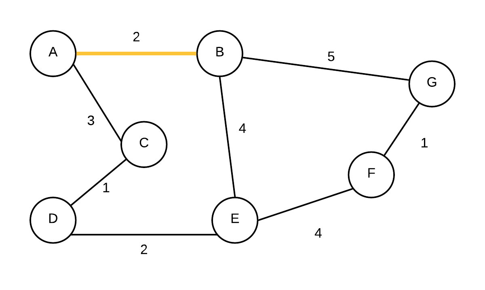

# Minimum Spanning Trees

A spanning tree is a connected, acyclic subgraph of a graph $$G=(V,E)$$.  That is it is the subset of edges that are connected and acyclic.  If G itself is not connected, then we can generalize this to a spanning forest. 

A minimum spanning tree of a graph $$G=(V,E)$$ with weight function $$w(e)$$ for each $$e \in E$$, is a spanning tree that has the smallest total weight.

## How to find a minimum spanning tree

To find an MST, we can either start with every edge in the graph and remove edges till we get an MST or we can select edges till we form an MST.  

For the removal method,  we can start out with every edge in the graph and start eliminating the edges with the highest weights.  An edge can be removed as long as we don't disconnect some vertex \(ie if that is the only edge to a vertex, we can't remove it\). We keep removing edges until we have an MST.  However, this is not practical.  If there are n nodes in a graph, a spanning tree has n-1 edges.  potentially there are $$(n)(n-1)\over2$$edges in total.  This means that any algorithm that finds an MST in this manner would end up with worst case $$\Omega (n^2)$$

Instead of removing edges, we can find the MST by building the MST instead.  The general generic algorithm for doing this is as follows:

```text
greedyMST(G=(V,E)){
    T=[];  //empty set of edges
    while(T is not an MST){
        find an edge e from E that is safe for T
        add e to T
    }
}
```

Now... this is a very generic algorithm and there are parts not yet defined.  Lets start with looking for an $$e$$ being safe for T.  An edge e is safe for T iff adding e to T makes T subset of some MST of G.  Of course... problem is how do we know if e is part of some MST of G when that is exactly what this function is suppose to find?


Theorem: If G is a connected, undirected weighted graph and T is a subset of some MST of G and e is any edge of minimum weight that are in different connected components of T, then adding e is safe for T  \(See text for proof\)


### Kruskal's Algorithm

Kruskal's algorithm starts by sorting edges according to weights.  It then picks the smallest edge out and adds it to T only if the end points are in different connected components.  If we use something like a BFS or DFS to find connected components, it will be very slow.  Instead, what we can do is use a disjoint set

```text
KruskalsMST(G=(V,E)){
    T=[];  //set of edges that form MST, initially empty
    sort edges in E by its weight
    
    //create a set for each vertex
    for(each vertex v in V) {
        makeSet(v);
    }
    
    for(each edge e=(u,v) in E){
        //find reps for endpoints of edge
        ep1=findSet(u);
        ep2=findSet(v);
        
        //if different reps then they are not in same set
        if(ep1!=ep2){
            //union them the set together
            union(ep1,ep2);
            
            //add e to the result
            add e to T;
        }    
    }
}
```

#### Example

So let us consider the following graph:

 


Given the graph above, the edges sorted in non-descending order by weight are: \(C,D\), \(F,G\), \(A,B\),\(D,E\),\(A,C\), \(B,E\), \(E,F\),\(B,G\).  We will exam the edges in this order in the example below

<table>
  <thead>
    <tr>
      <th style="text-align:left">Step #</th>
      <th style="text-align:left">graph, T shown in yellow</th>
      <th style="text-align:left">Disjoint Sets</th>
      <th style="text-align:left">Comments</th>
    </tr>
  </thead>
  <tbody>
    <tr>
      <td style="text-align:left">Initial</td>
      <td style="text-align:left">
        
        <br />T= {}</td>
      <td style="text-align:left">{A}, {B}, {C}, {D},{E},{F},{G}</td>
      <td style="text-align:left">every vert is in its own
        <br />disjoint set, initial MST is empty</td>
    </tr>
    <tr>
      <td style="text-align:left">
        <p>1</p>
        <p></p>
      </td>
      <td style="text-align:left">
        <p>
          
        </p>
        <p>T={(C,D)}</p>
      </td>
      <td style="text-align:left">{A}, {B}, {CD}, {E},{F},{G}</td>
      <td style="text-align:left">(C,D) is added first. They were in different disjoint sets</td>
    </tr>
    <tr>
      <td style="text-align:left">2</td>
      <td style="text-align:left">
        <p>
          
        </p>
        <p>T={(C,D), (F,G)}</p>
      </td>
      <td style="text-align:left">{A}, {B}, {C,D}, {E},{F,G}</td>
      <td style="text-align:left">(F,G) is added next. They were not in the same disjoint set</td>
    </tr>
    <tr>
      <td style="text-align:left">3</td>
      <td style="text-align:left">
        <p>
          
        </p>
        <p>T={(C,D), (F,G),(A,B)}</p>
      </td>
      <td style="text-align:left">{A,B}, {C,D}, {E},{F,G}</td>
      <td style="text-align:left">(A,B) is added next as they were not in the same disjoint set</td>
    </tr>
    <tr>
      <td style="text-align:left">4</td>
      <td style="text-align:left">
        
        <br />T={(C,D), (F,G),(A,B),(D,E)}</td>
      <td style="text-align:left">{A,B}, {C,D,E}, {F,G}</td>
      <td style="text-align:left">(D,E) is added next as they were not in the same disjoint set</td>
    </tr>
    <tr>
      <td style="text-align:left">5</td>
      <td style="text-align:left">
        
        <br />T={(C,D), (F,G),(A,B),(D,E),(A,C)}</td>
      <td style="text-align:left">{A,B,C,D,E}, {F,G}</td>
      <td style="text-align:left">(A,C) is added next, they were not in the same disjoint set</td>
    </tr>
    <tr>
      <td style="text-align:left">6</td>
      <td style="text-align:left">
        <p>
          
        </p>
        <p>T={(C,D), (F,G),(A,B),(D,E),(A,C)}</p>
      </td>
      <td style="text-align:left">{A,B,C,D,E,F,G}</td>
      <td style="text-align:left">(B,E) was next but not added because B and E are in same disjoint instead.
        We next consider (E,F) and as they are in different sets we connect them.
        (B,G) are in same disjoint set so we are now done</td>
    </tr>
  </tbody>
</table>

### Prim's Algorithm

We pick a vertex $$v \in V$$ to be the "root" of the MST.  After that we simply grow the tree by joining isolated vertices one at a time.  An isolated vertex is any vertex that isn't part of the MST yet picking the smallest edge weight.  To support this, we will use a MinHeap.  We queue into this heap edges that will connect an isolated vertex with the current MST. We use infinity if there is no direct edge yet to any vertex in the MST

<table>
  <thead>
    <tr>
      <th style="text-align:left">Step</th>
      <th style="text-align:left">Graph</th>
      <th style="text-align:left">Heap (vertex, parent, weight to parent), listed with by priority (smaller
        weight)</th>
      <th style="text-align:left">Comments</th>
    </tr>
  </thead>
  <tbody>
    <tr>
      <td style="text-align:left">Initial</td>
      <td style="text-align:left">
        <p>
          
        </p>
        <p>T={}</p>
      </td>
      <td style="text-align:left">
        <p>(A, NIL,0)</p>
        <p>(B, NIL,)</p>
        <p>(C, NIL,)</p>
        <p>(D, NIL,)</p>
        <p>(E, NIL,)</p>
        <p>(F, NIL,)</p>
        <p>(G, NIL,)</p>
      </td>
      <td style="text-align:left">Initial state. pick A as root</td>
    </tr>
    <tr>
      <td style="text-align:left">1</td>
      <td style="text-align:left">
        <p>
          
        </p>
        <p>T={}</p>
      </td>
      <td style="text-align:left">
        <p></p>
        <p>(B, A,2)</p>
        <p>(C, A,3)</p>
        <p>(D, NIL,)</p>
        <p>(E, NIL,)</p>
        <p>(F, NIL,)</p>
        <p>(G, NIL,)</p>
      </td>
      <td style="text-align:left">update edge weights, parents of B and C</td>
    </tr>
    <tr>
      <td style="text-align:left">2</td>
      <td style="text-align:left">
        <p>
          
        </p>
        <p>T={(A,B)}</p>
      </td>
      <td style="text-align:left">
        <p>(C, A, 3)</p>
        <p>(E, B, 4)</p>
        <p>(G, B, 5)</p>
        <p>(D, NIL,)</p>
        <p>(F, NIL,)</p>
      </td>
      <td style="text-align:left">Take out vertex with smallest weight(B) and add edge to its parent to
        the MST. update edge weights and parents of E and G</td>
    </tr>
    <tr>
      <td style="text-align:left">3</td>
      <td style="text-align:left">
        <p>
          
        </p>
        <p>T={(A,B), (A,C)}</p>
      </td>
      <td style="text-align:left">
        <p>(D, C, 1)</p>
        <p>(E, B, 4)</p>
        <p>(G, B, 5)</p>
        <p>(F, NIL,)</p>
      </td>
      <td style="text-align:left">Take out vertex with smallest weight (C) and add edge to its parent to
        the MST. update edge weights and parent of D.</td>
    </tr>
    <tr>
      <td style="text-align:left">4</td>
      <td style="text-align:left">
        
        <br />T={(A,B),(A,C),(C,D)}</td>
      <td style="text-align:left">
        <p>(E, D, 2)</p>
        <p>(G, B, 5)</p>
        <p>(F, NIL,)</p>
      </td>
      <td style="text-align:left">Take out vertex with smallest weight (D) and add edge to its parent to
        the MST. update edge weights and parent of E because cost to E is less
        going through D and not B.</td>
    </tr>
    <tr>
      <td style="text-align:left">5</td>
      <td style="text-align:left">
        <p>
          
        </p>
        <p>T={(A,B),(A,C),(C,D),(D,E)}</p>
      </td>
      <td style="text-align:left">
        <p>(F, E, 4)</p>
        <p>(G, B, 5)</p>
      </td>
      <td style="text-align:left">Take out vertex with smallest weight (E) and add edge to its parent to
        the MST. update edge weights and parent of F</td>
    </tr>
    <tr>
      <td style="text-align:left">6</td>
      <td style="text-align:left">
        <p>
          
        </p>
        <p>T={(A,B),(A,C),(C,D),(D,E),(E,F)}</p>
      </td>
      <td style="text-align:left">(G, F, 1)</td>
      <td style="text-align:left">Take out vertex with smallest weight (F) and add edge to its parent to
        the MST. update edge weights and parent of G because cost to G is less
        going through F and not B.</td>
    </tr>
    <tr>
      <td style="text-align:left">7</td>
      <td style="text-align:left">
        <p>
          
        </p>
        <p>T={(A,B),(A,C),(C,D),(D,E),(E,F),(F,G)}</p>
      </td>
      <td style="text-align:left">&lt;empty&gt;</td>
      <td style="text-align:left">Take out vertex with smallest weight (G) and add edge to its parent to
        the MST.</td>
    </tr>
  </tbody>
</table>

