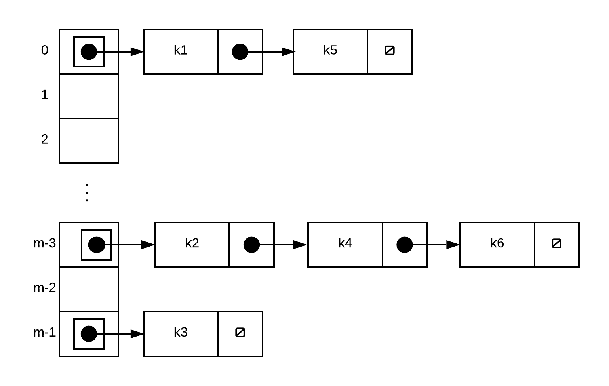

# Hash Tables

Suppose you wanted to track a set of key/value pairs. That is you want to be able insert/search/delete based on the key but it would return the associated value.  

How would this be accomplished?  Now, if the possible keys were small, you could create a lookup table.  For example, suppose you were trying to do something like tracking the frequency of characters in an ASCII based text file.  ASCII values range from 0 to 127, extended ascii from 0 to 255.    This is a relatively small set of keys.  We can simply associate each ascii value to an array subscript and store the frequency in the corresponding element.

Thus suppose your file said \(assuming there are no leading or trailing blanks\):

```text
The quick brown dog jumped over the lazy fox!
```

The table to store the frequencies would be an array of 256 unsigned integers.    Thus we would end up with:

```text
'T' is ASCII 84, table[84]=1
'h' is ASCII 104, table[104]=2
'e' is ASCII 101, table[101]=4
' ' (space) is ASCII 32, table[32]=8
...
etc
```

It would be very fast to look up/or update a frequency.  

However what if what we wanted to track a larger set of possible keys?  For example suppose we wanted to track the frequency of ascii digrams \(2 character combos\).  We would have 256\*256 = 65 536 ranging from 0 to 65 535.  Relatively speaking this is still a very small number of keys so we can use the same method.  Just need to convert each character to an index by doing something like $$c1(256) + c2$$ . where $$c1$$ and $$c2$$ are the ASCII encoding of the first and second characters of the digrams respectively.

Now, what if we wanted to count the frequency of every word \(defined as 1 or more alphanumeric characters separated by 1 or more non-alphanumeric characters\).  

What if it was bigger still?  What if instead of storing the frequency of letters, we wanted to store the frequency of words within a file \(defined as a string of alphanumeric characters separated by 1 or more non-alphanumeric characters\).  This could potentially be an infinitely large set of possible keys as there is no limit on the word length.  Even if we were to limit the number of characters to some maximum wordlength m?  If we did this, then for each character in the word there are 62 possibilities \(26 upper, 26 lower, 10 numeric\).  Thus, the number of possible keys length exactly m is 62^m.  It doesn't take a very large m before the number of possible words become too big to give each of them an element with an array \(our array would have to be huge\).

Note that most of these potential keys are not actually likely to exist in the text file.  Thus, we only need to store information about the words that actually do exist.  The solution to this problem is a hash table

A hash table is a table that holds a set of key-value pairs.    In the above example of storing frequencies of words, the key would be the word.  The value would be the frequency of the word within the text file.

A hash table uses a hash function to transform a key into a valid hash index.

That is hash\(k\) = hashindex

The hash function is deterministic.  That is if we give it the same key, the same hashindex is always returned.  A discussion of hash functions will be given a little later. 

Unlike the very first example where the array index matched the key, our array index and keys will not match each other and thus, we must store both the key and value together at each element.

In general the hash table supports the following functions:

* insert\(k, v\) - inserts the key-value pair k-v into the hash table
* delete\(k\) - finds and removes a key-value pair with a key matching k
* search\(k\) - finds and returns the value associated with key matching k

To implement each of the above function, the general algorithm is:

* calculate $$i = hash(k)$$, $$i$$ is the hash index
* use $$i$$ to access $$array[i]$$and perform the necessary operation on array\[i\].
* For example if we called insert\(k,v\) we start by calculaing $$hash(k)$$.  This will produce a hashindex i.
* We then place $$(k,v)$$into $$array[i]$$.  


Think of an operation as being performed on array\[hash\(k\)\] instead of using k directly as the index.


The basics of hash tables are very simple but there are a number of problems that we must deal with

* what hash function do we use?
* what happens if two different keys get hashed into the same position \(collision\)

### The pigeon hole principle

Suppose you had n mailboxes and m letters where m &gt; n  \(more letters than mailboxes\).  If that is the case then at least one mailbox must contain 2 letters.    This is effectively what the situation is with our hash function and keys.  The number of mailboxes we have is n \(capacity of array\).  The total number of possible keys is m.  Usually the total number of possible keys is bigger than the capacity of the array. \(usually significantly bigger\).  Based on the pigeon hole principle, what this means is that the hash function must return the same value for at least two distinct keys.

Suppose the hash table were to contain two distinct keys $$k_1$$and $$k_2$$.  A _**collision**_ occurs if $$hash(k_1) == hash(k_2)$$.  

Our implementation of hash tables therefore must be able to deal with collisions.

## Collision Resolution

Collision resolution is the process of dealing with collisions.  In general there are two forms general methods for dealing with collisions.  Closed Addressing and Open addressing. 

A closed addressing system, the key value pair $$(k,v)$$ must be stored at index $$hash(k)$$, while in open addressing systems we allow $$(k,v)$$ to be stored elsewhere \(but in a predictable manner\).  This next sections looks at how this is done.

### Closed Addressing - Chaining

Chaining is a simple way of handling collisions.  Instead of storing the key-value pair $$(k,v)$$ into the array directly, chaining creates an array of linked lists, initially all empty.  For each operation involving key $$k$$

* calculate  $$ i = hash(k) $$
* perform operation \(insert/delete/search\) on the linked list at array\[i\]

#### Example

Suppose we were to have 6 keys $$ (k_1, k_2, k_3, k_4,k_5, k_6)$$.  The hash function returns as follows for these keys:  $$(hash(k_1) == 0, hash(k_2) == m-3, hash(k_3) ==m-1, hash(k_4) == m-3, hash(k_5) == 0, hash(k_6) == m-3$$

A table created using chaining would store records as follows \(note that only key's are shown in diagram for brevity\)



#### Worst case run time

_**insert\(k,v\)**_ - cost to find the correct linked list + cost to search for k within the linked list, + cost to add new node or modify existing if k is found

_**search\(k\)**_ - cost to find the correct linked list + cost to search for k within the linked list

_**delete\(k\)**_ - cost to find the correct linked list + cost to search for k within the linked list + cost to remove a node from list

In each of the above cases, cost of to find the correct linked list is $$ \theta(1) $$ assuming that the cost of calculating hash is constant relative to number keys.  We simply need to calculate the hash index, then go to that location

The cost to add a node, modify a node or delete a node \(once node has been found\) is $$\theta(1)$$ as that is the cost to remove/insert into linked list given pointers to appropriate nodes

The cost to search through linked list depends on number of nodes in the linked list.  At worst, every single key hashes into exactly the same index.  If that is the case, the run time would be $$\theta(n)$$

Thus,  the worst case run time is $$\theta(n)$$.  In reality of course, the performance is signficantly better than this and you typically don't encounter this worst case behaviour.  Notice that the part that is slow is the search along the linked list.  If our linked list is relatively short then the cost to search it would also not take very long.

#### Average case run time

We begin by making an assumption called Simple Uniform Hash Assumption \(SUHA\).  This is the assumption that any key is equally likely to hash to any slot.  


## Open Addressing

With hash tables where collision resolution is handled via open addressing, each record actually has a set of hash indexes where they can go.  If the first location at the first hash index is occupied, it goes to the second, if that is occupied it goes to the third etc.  The way this set of hash indexes is calculated depends on the probing method used \(and in implementation we may not actually generate the full set but simply apply the probing algorithm to determine where the "next" spot should be\).  We will begin by discussing the general algorithm used then look at how the various probing methods generate the set of indices for.

###  Basic Storage

Due to way open addressing works and how we will eventually need to handle insertion, each array element not only must hold the key value pair but it must also hold a status.  The status of each slot is:

* empty - slot is empty, has never held any key-value pair, does not currently hold any record
* used - slot is currently in used.  It holds a key-value pair.  Do not put anything into a spot that is used
* deleted - slot use to hold a key-value pair but currently doesn't.  When we are looking for a record we need to continue searching when we see deleted slots \(more on this later\)

### Searching

_**search\(k\)**_

The search algorithm is as follows:

* use hash function to find index of where an item should be.
* Check to see if the item's key matches that of key we are looking for
* If it isn't there search for key-value pairs in the "next" slot according to the probing method until either it found, or until an we hit an empty slot.  Note that only empty slots stop searching not deleted slots
* NOTE: it is important **not** to search the whole array till you get back to the starting index. As soon as you see an empty slot, your search needs to stop. If you don't, your search will be incredibly slow for any item that doesn't exist.

### Insertion

_**insert\(k,v\)**_

The insertion algorithm is as follows:

* search for record with matching key \(to ensure it isn't there\)
* If it is there, simply replace the value with the v passed into insert
* If it is not there, start looking for the first "open" spot. in the set of probed indices and place k,v there.

### Removal

remove\(k\)

The removal algorithm is as follows:

* search for the record with matching key.
* If you find it, mark the spot as deleted

### Probing methods:

#### Linear probing

Linear probing is the simplest method of defining "next" index for open address hash tables.  Suppose hash\(k\) = i, then the next index is simply i+1, i+2, i+3, etc.  You should also treat the entire table as if its round \(front of array follows the back\).  Thus, the actual formula is: i, \(i+1\)%capacity, \(i+2\)%capacity,\(i+3\)%capacity etc.

#### Quadratic Probing

With linear probing everytime two records get placed beside each other in adjacent slots, we create a higher probability that a third record will result in a collision \(think of it as a target that got bigger\).  One way to avoid this is to use a different probing method so that records are placed further away instead of immediately next to the first spot.  In quadratic probing, instead of using i, i+1, i+2 etc.  we use: i, i+$$1^2$$, i+$$2^2$$, i+$$3^2$$  again we treat the hash table as if its round

Double Hashing


