# Binary Heap

One way to implement a priority queue is to a data structure called a binary heap \(which has nothing to do with "heap" memory\).  This section presents what a binary heap is and how it is implemented

## Binary Heap - Basic Definitions

Before we begin, the definitions below look involves trees. It may be a good idea to look at those definitions first so that the definitions with respect to heaps make more sense.

**Binary Heap** - A binary heap is a **complete binary tree** where the **heap order property** is always maintained.

**Binary Tree** - A binary tree is either a\) empty \(no nodes\), or b\) contains a root node with two children which are both binary trees.

**Complete Binary Tree** - A binary tree where there are no missing nodes in all except at the bottom level. At the bottom level the missing nodes must be to the right of all other nodes

These binary trees are complete.

The following binary trees are not complete. The first one is missing a node one level higher than leaves, the second is missing further left in the tree than an existing node

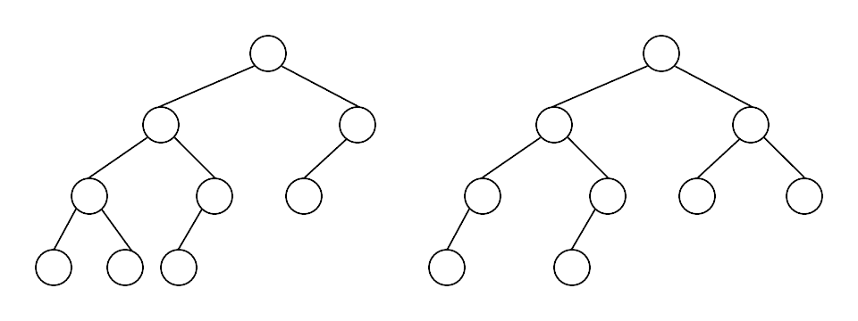

**Heap Order Property**: For each node, the parent of the node must have a higher priority, while its children must have a lower priority. There is no ordering of priority other than this rule. Thus, the highest priority item will be at the root of the tree. 

Below is a heap where we define the smaller value \(aka MinHeap\) as having higher priority: 

A MaxHeap is a heap where bigger numbers have higher priority.  Other than which value is considered to be higher priority, there is no real difference between a minheap and maxheap.

## Binary Heap - Insertion

Insertion into a heap must maintain both the complete binary tree structure and the heap order property. To do this what we do is the following.

* create a new empty node in the left most open spot at the bottom level of the tree
* If value can be placed into node without violating heap order property put it in
* otherwise pull the value from parent into the empty node
* repeat the previous two steps until the value can be placed

This process effectively creates an empty node starting at the bottom of the tree. The empty node moves up until it is in the correct position and the value can be placed inside the empty node. This process of moving the empty node towards the root is called _**percolate up**_

### **Example**

Create a heap by inserting these number in the order given: 10, 6, 20, 5, 16, 17, 13, 2

#### **Insert 10**

#### Insert 6

#### Insert 20

#### Insert 5

#### Insert 16

#### Insert 17

#### Insert 13

#### Insert 2

## Binary Heap - Delete

The highest priority value is always the value that is removed from the binary heap. The way that the Heap is set up, the node with the highest priority is at the root. Finding it is easy but the removal process must ensure that both the complete binary tree structure along with the heap order property is maintained.  Therefore, just removing the root would be a bad idea.

In order for the complete binary tree property to be maintained we will be removing the right most node at the bottom level. Note that a complete binary tree with n nodes can only have 1 shape, so the shape is pretty much determined by the fact that removing a value creates a tree with one fewer node.

The empty spot that had been created by the removal of the value at root must be filled and the value that had been in the rightmost node must go back into the heap. We can accomplish this by doing the following:

* If the value could be placed into the empty node \(remember, this starts at root\) without violating the Heap Order Property, put it in and we are done
* otherwise move the child with the higher priority up \(the empty spot moves down\).
* Repeat until value is placed

The process of moving the empty spot down the heap is called _**percolate down**_

### Example

This is what would happen if we were to to perform a single delete operation on the following heap:

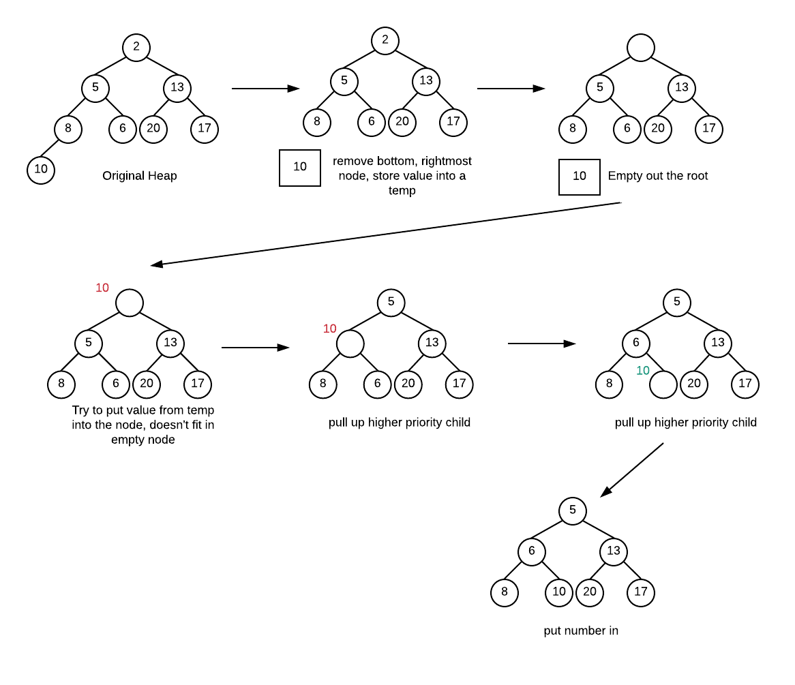

## Implementation

Clearly we want to implement the heap in as simple a manner as possible. Although we can use a link structure to represent each node and their children, this structure is actually not good for a heap.  We really don't need the linking structure because our tree is a complete binary tree. This makes it very easy for us to use an array to represent our tree.

Idea is this. Store the data in successive array elements. Use the index values to find the child and parent of any node.

Suppose data was stored in element i. The left child of that node is in element 2i+1 The right child of the node is in element 2i+2 The parent of the node is stored in \(i-1\)/2 \(for all but root node which has no parent\).  This representation effectively numbers the nodes from top to bottom, left to right from 0.

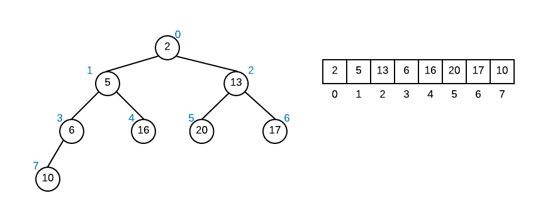

This representation is very convenient because when we add values to the end of the array it is like we are adding a node to the leftmost available spot at the bottom level. 

## Heapify and Heapsort

Since our heap is actually implemented with an array, it would be good to have a way to actually create a heap in place starting with an array that isn't a heap and ending with an array that is heap.  While it is possible to simply "insert" values into the heap repeatedly, the faster way to perform this task is an algorithm called Heapify.

In the Heapify Algorithm, works like this:

Given a node within the heap where both its left and right children are proper heaps \(maintains proper heap order\) , do the following:

* If the node has higher priority than both children, we are done, the entire heap is a proper heap
* Otherwise 
  * swap current node with higher priority child
  * Heapify that subtree

Effectively what is happening is that we already know that both the left and right children are proper heaps.  If the current node is higher priority than both children then the entire heap must be proper

However if its not then we do a swap, this means that the current node's value has now gone down into one of the subtrees.  This could cause that subtree to no longer be a heap because the root of that subtree now has a value of lower priority than it use to have.

### Example: MaxHeapify

This example will start with an array that is not heap.  It will perform maxheapify on it to form a max heap \(bigger values have higher priority\)

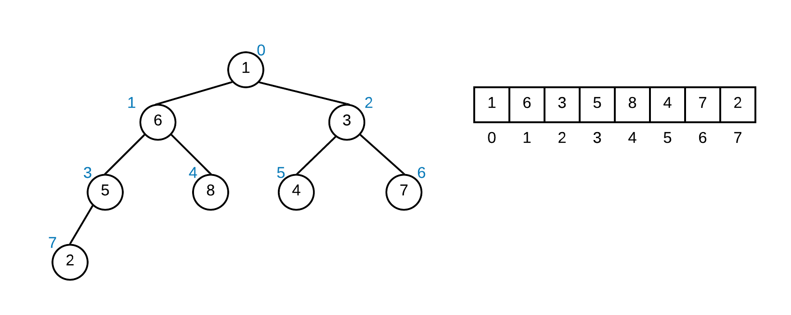

Firstly, all leaf nodes are valid heaps.  Since they have no subtree, we don't need to deal with those nodes.  They are highlighted in green in this next picture.  We start from the back of the array at the element corresponding to the first non-leaf node.

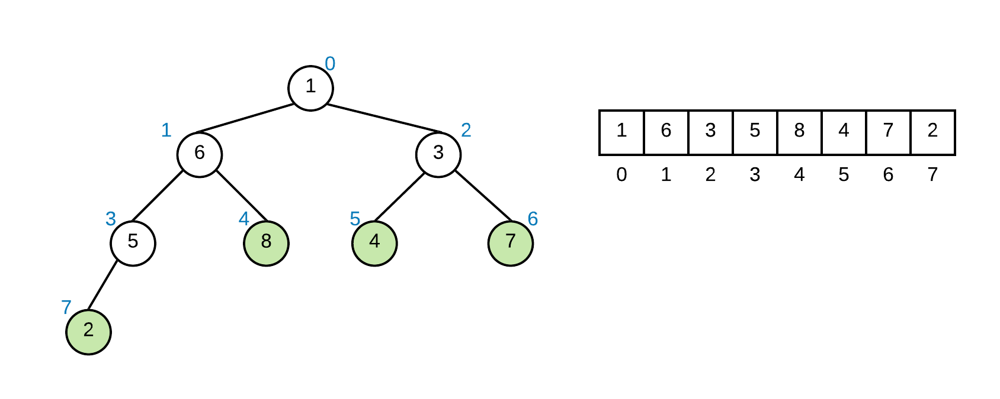

First node to consider is 5.  the nodes starting at 6 is a proper heap so we are good on this

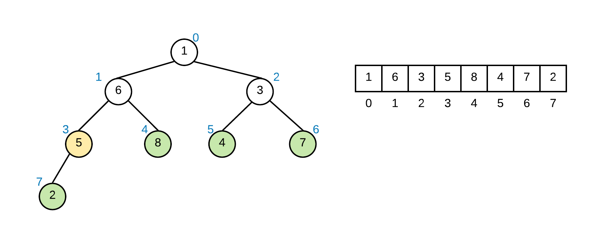

Second node to consider is 3.  both 4 and 7 are bigger than 3 and thus have higher priority.  However, 7 is higher priority than 4, so we swap these two values

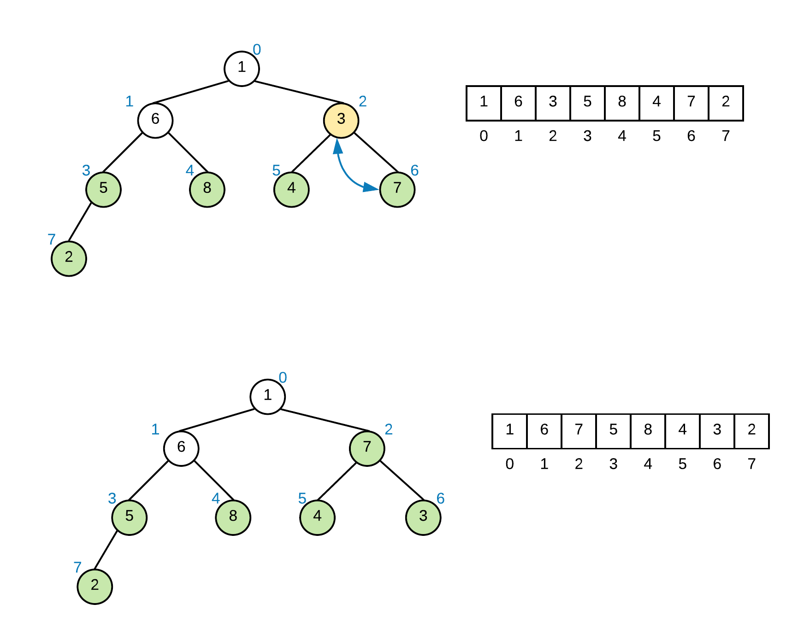

Next consider the node with 6.  6 is higher priority than 5 but not higher priority than 8, so we swap them.  6 is now in a leaf node and thus we can stop

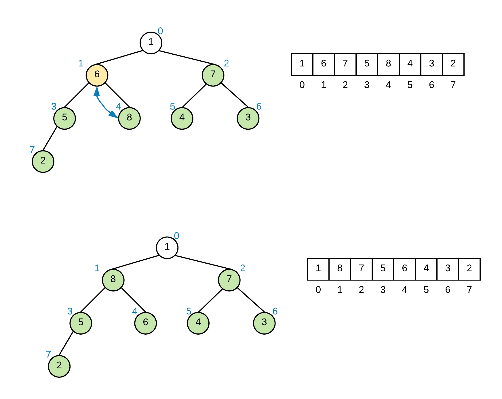

Lastly we consider the node 1.  both 8 and 7 have higher priority than 1, but 8 is higher priority than 7 and thus we swap 8 and 1 first.  

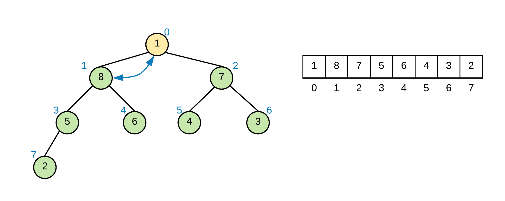

At this point we need to heapify the subtree that now has 1 as it's root.  We swap it with the higher priority child \(6 in this case\).  Notice that because we won't need to do anything to the right subtree with 7 as root, as that subtree was not modified.  

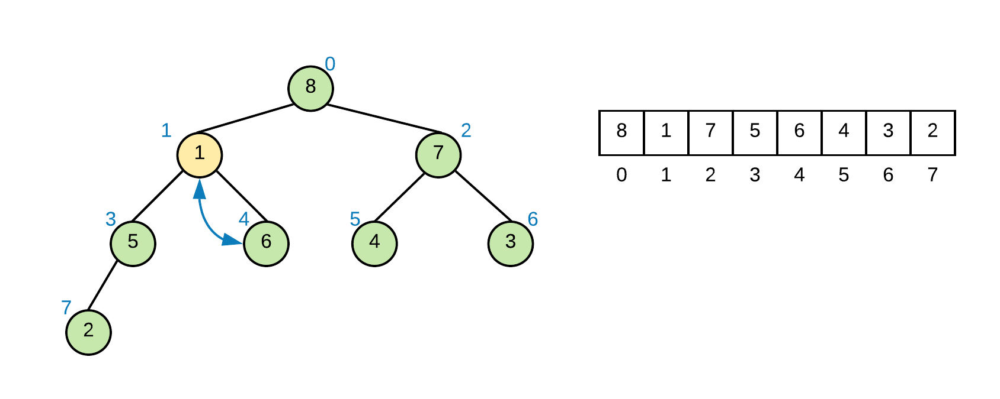

After the final swap we have a proper max heap

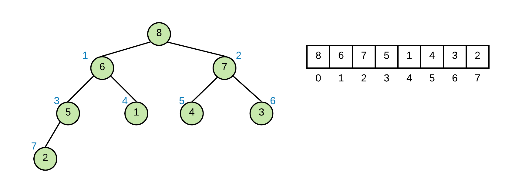

