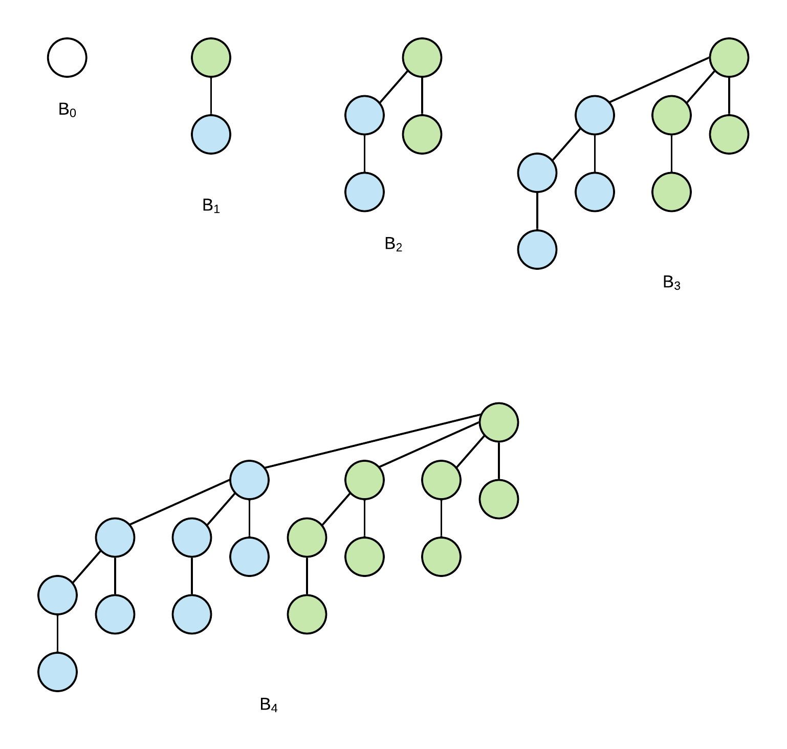
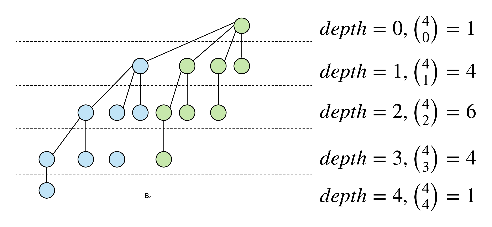
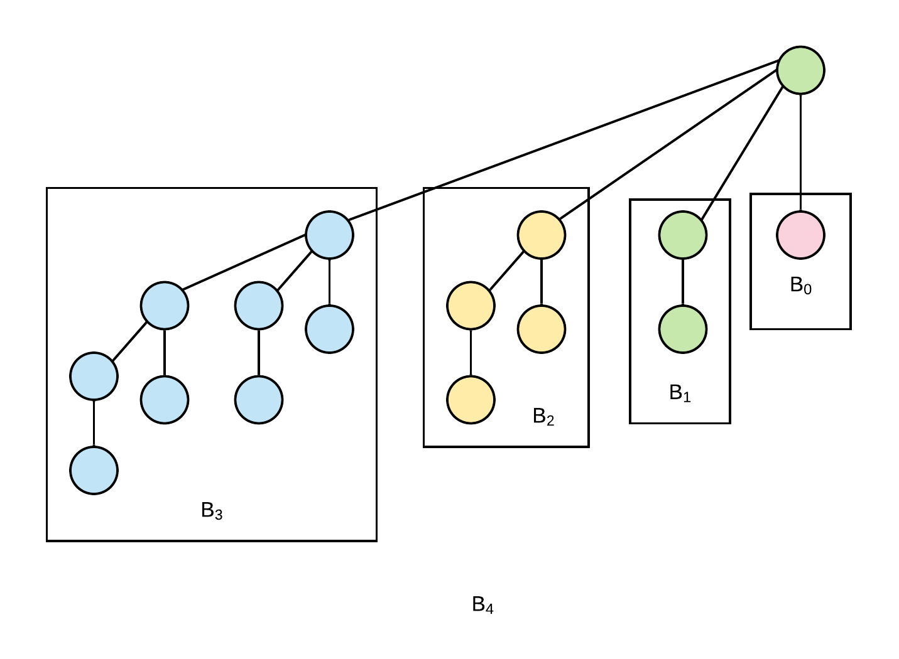

# Binomial Heaps and Binomial Trees

Another data structure that could be used to implement a priority queue is a binomial heap.  The advantage of a binomial heap is that it supports the _**union**_ operation which combines two binomial heaps into one in $$O(log n)$$ .  While it is possible to write the _**union**_ operation using a binary heap, the run time of the operation would be  $$\theta(n)$$  \(append one array to the other then perform heapify on the array\).  

A _**binomial heap**_ is a collection \(forest\) of _**binomial trees**_**.** 

## **Binomial Trees**

 A binomial tree $$B_k$$is an ordered tree where

* $$B_0$$ is a tree with exactly one node
* $$B_k$$ is made of two binomial trees $$B_{k-1}%$$ that are linked such that the root of one tree is the left most child of the root of the other tree.

A binomial tree $$B_k$$has 4 properties:

1. there are $$2^k$$nodes in $$B_k$$
2. the height of $$B_k$$is $$k$$
3. there are exactly $$k \choose i $$nodes at depth i \(where root is at depth 0\)

   

4. the root degree k.  for the children of the root you will find that their degree is k-1, k-2, ... 

   

## Binomial Heaps

A binomial heap is a collection of binomial trees that meet the following criteria:

1\) The values within each binomial heap follow the min-heap order property.  That is the parent of a node must not be smaller than the child of the node

2\) There can be only one tree of any degree within the heap \(as viewed from its root node\)

A binomial heap of with n nodes will support the following operations \(with the run times given\):

* Make-Heap - $$\theta(1)$$ - makes an empty heap
* Insert \(x\) - $$O(log n)$$ - inserts x into the heap
* Minimum\(\) - $$O(log n)$$returns the smallest item in the heap
* Extract Minimum - $$\theta(log n)$$removes the smallest item from the heap
* Union - $$O(log n)$$merges two heaps together into one heap

