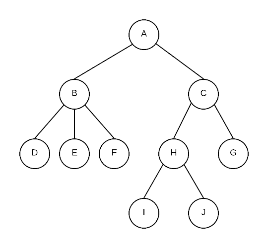

# Trees

A tree is a very important data structure. It has the ability to classify data and separate it reducing the overhead of search. It is used in many areas of computing. This section deals will introduce you to the idea of trees and some basic algorithms surrounding them.

## Definitions

This section will include some basic terminology used when describing trees. To help you understand the terminology, use the following diagram:

**Node**: the thing that store the data within the tree . \(each circle in the above diagram is a node\)

**Root Node**: the top most node from which all other nodes come from. A is the root node of the tree.

**Subtree**: Some portion of the entire tree, includes a node \(the root of the subtree\) and every node that goes downwards from there. A is the root of the entire tree. B is the root of the subtree containing B,D,E and F

**Empty trees**: A tree with no nodes

**Leaf Node**: A node with only empty subtrees \(no children\) Ex. D,E,F,I,J,and G are all leaf nodes

**Children**: the nodes that is directly 1 link down from a node is that node's child node. Ex. B is the child of A. I is the child of H

**Parent** the node that is directly 1 link up from a node. Ex. A is parent of B. H is the parent of I

**Sibling**: All nodes that have the same parent node are siblings Ex. E and F are siblings of D but H is not

**Ancestor**: All nodes that can be reached by moving only in an upward direction in the tree. Ex. C, A and H are all ancestors of I but G and B are not.

**Descendants** or **Successors** of a node are nodes that can be reached by only going down in the tree. Ex. Descendants of C are G,H,I and J

**Depth**: Distance from root node of tree. Root node is at depth 0. B and C are at depth 1. Nodes at depth 2 are D,E,F,G and H. Nodes at depth 3 are I and J

**Height**:  number of edges from root to furthest leaf.  The height of the above tree is 3.  By convention, the height of an empty tree is -1

**Path**: Set of branches taken to connect an ancestor of a node to the node. Usually described by the set of nodes encountered along the path.

**Binary tree**: A binary tree is a tree where every node has 2 subtrees that are also binary trees. The subtrees may be empty. Each node has a left child and a right child. Our tree is NOT a binary tree because B has 3 children.

**The following are NOT trees**

## Tree Implementation

By its nature, trees are typically implemented using a Node/link data structure like that of a linked list. In a linked list, each node has data and it has a next \(and sometimes also a previous\) pointer. In a tree each node has data and a number of node pointers that point to the node's children.

However, a linked structure is not the only way to implement a tree. We saw this when we used an array to represent a binary heap. In that case, the root was stored at index 0, for any node stored at index i, we calculate the left, right subtree, and parent node's indexes with formulas. However, if you do this, for non-complete trees, you could end up with many unused spaces in an array.

