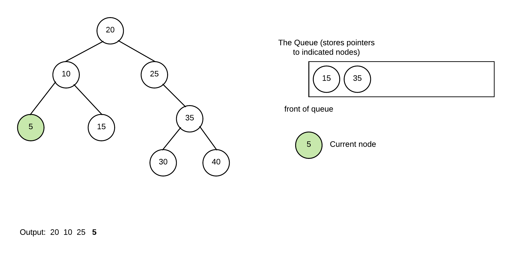

# Implementation

To implement a binary search tree, we are going to borrow some concepts from linked lists as there are some parts that are very similar.  In these notes we will look a few of the functions and leave the rest as an exercise.

Similar to a linked list, A binary search tree is made up of nodes.  Each node can have a left or right child, both of which could be empty trees.  Empty trees are represented as nullptrs.  The binary search tree object itself only stores a single pointer that points at the root of the entire tree.     The data stored within the nodes must be of some type that is comparable.  We will thus begin our binary search tree class declaration in a similar manner to that of a linked list.  The code for each of the functions will be filled in later in this chapter.

```cpp
template <typename T>
class BST{
    struct Node{
        T data_;
        Node* left_;
        Node* right_;
        Node(const T& data, Node* left=nullptr, Node* right=nullptr){
            data_=data;
            left_=left;
            right_=right;
        }        
    };
    //single data member pointing to root of tree
    Node* root_; 
public:
    BST(){...}
    void insert(const T& data){...}
    bool search(const T& data) const {...}
    void breadthFirstPrint() const {...}
    void inOrderPrint() const {...}
    void preOrderPrint() const {...}

    ~BST(){...}
};
```

If you rename the data members above you actually see that its pretty similar to that of a doubly linked list... The key to the operations of a BST lies not in what data is declared,  but rather how we organize the nodes.  The next 2 sections of the notes we will look at the implementation of the functions listed as public member functions above.  In some cases a function may be written both iteratively and recursively and both versions will be looked at

## Iterative Methods

This section looks at the functions that are implemented iteratively \(or the iterative version of the functions\)

### Constructor

When we create our tree, we are going to start with an empty tree.  Thus, our constructor simply needs to initialize the data member to nullptr.


```cpp
template <typename T>
class BST{
    struct Node{
        T data_;
        Node* left_;
        Node* right_;
        Node(const T& data, Node* left=nullptr, Node* right=nullptr){
            data_=data;
            left_=left;
            right_=right;
        }        
    };
    //single data member pointing to root of tree
    Node* root_; 
public:
    BST(){
        root_=nullptr;
    }
...
};
```

### Insert - Iterative version

This function will insert data into the tree.  There are two ways to implement this function, either iteratively or recursively.  We will start by looking at the iterative solution.  In this situation, we begin by taking care of the empty tree situation.  If the tree is empty we simply create a node and make root\_ point to that only node.  Otherwise, we need to go down our tree until we find the place where we must do the insertion and then create the node.

```cpp
template <typename T>
class BST{
    struct Node{
        T data_;
        Node* left_;
        Node* right_;
        Node(const T& data, Node* left=nullptr, Node* right=nullptr){
            data_=data;
            left_=left;
            right_=right;
        }        
    };
    //single data member pointing to root of tree
    Node* root_; 
public:
...
    void insert(const T& data){
        if(root_==nullptr){
            root_=new Node(data);
        }
        else{
            bool isInserted=false;   //set to true when once we insert the node
            Node* curr=root_;        //used to iterate through nodes
            while(!isInserted){
                if(data < curr->data_){
                    //data belongs in left subtree because it is 
                    //smaller than current node
                    if(curr->left_){
                        //there is a node to the left so go left
                        curr=curr->left_;
                    }
                    else{
                        //there isn't a node to left
                        //create a node to the left
                        curr->left_=new Node(data);
                        isInserted=true;
                    }
                }
                else{
                    //data belongs in right subtree.
                    if(curr->right_){
                        //there is a node to the right so go right
                        curr=curr->right_;
                    }
                    else{
                        //there isn't a node to right
                        //create a node to the right
                        curr->right_=new Node(data);
                        isInserted=true;
                    }
                }
            }
        }
    }
...
};
```

### Search - Iterative version

The key operation that is supported by a binary search tree is search.  For our purposes we will simply look at finding out whether or not a value is in the tree or not.  The search operation should never look at the entire tree.  The whole point of the binary search tree is to make this operation fast.  We should search it so that we can eliminate a portion of the tree with every search operation.

To do this we start at the root and compare that node's data against what we want.  If it matches, we have found it.  If not, we go either left or right depending on how data relates to the current node.  If at any point we have an empty tree \(ie the pointer we are using for iterating through the tree becomes nullptr\)  we stop the search and return false.  If we find a node that matches we stop and return true.

```cpp
template <typename T>
class BST{
    struct Node{
        T data_;
        Node* left_;
        Node* right_;
        Node(const T& data, Node* left=nullptr, Node* right=nullptr){
            data_=data;
            left_=left;
            right_=right;
        }        
    };
    //single data member pointing to root of tree
    Node* root_; 
public:
    bool search(const T& data) const {
        Node* curr=root_;    //used  to iterate through tree        
        bool found=false;    //true if we find it false if we haven't yet

        //loop until we either find it or we have no more tree
        while(!found && curr){ 
            if(data==curr->data_){
                found=true;
            }
            else if(data < curr->data_){
                curr=curr->left_;
            }
            else{
                curr=curr->right_;
            }
        }
        return  found;
    }
};
```

### Breadth First Print

Writing a breadth-first traversal involves using the queue data structure to order what nodes to deal with next.  You want to deal with the nodes from top to bottom left to right, and thus you use the queue to order the nodes.   Here is an example of how we will do this.

We begin by declaring a queue \(initially empty\)


#### Prime the Queue

We start prime the queue by putting the root into the queue.  In this example, we always check to ensure no nullptrs are ever added to the queue.  Alternatively we allow the addition of nullptrs and decide how to deal with them when we dequeue.  


Dequeue front of node and process it by adding its non-nullptr children into the queue, print the node


Continue by dequeuing front node and processing it in same manner


Repeat again as 25 only has a right child only it is added


Repeat once again with 5 which has no children thus nothing is added to queue



Repeat again with 15 \(also no children\)


Repeat with 35 and add its children

 


Continue by removing 30


And one more time with 40


At this point queue is empty and thus, we have completed our breadth-first print of the tree.

In code form, this is how we will write our code \(we assume we have a template queue class already implemented\):

```cpp
template <typename T>
class BST{
    struct Node{
        T data_;
        Node* left_;
        Node* right_;
        Node(const T& data, Node* left=nullptr, Node* right=nullptr){
            data_=data;
            left_=left;
            right_=right;
        }        
    };
    //single data member pointing to root of tree
    Node* root_; 
public:
...
    void breadthFirstPrint() const{
        Queue<Node*> theNodes;  //we assume the queue class has these functions
                                //enqueue(), dequeue(), front(), isEmpty()
        //prime queue
        if(root_){
            theNodes.enqueue(root_);
        }
        //while we have nodes to deal with
        while(!theNodes.isEmpty()){
            //deal with first node and remove it from queue
            Node* curr=theNodes.front();
            theNodes.dequeue();
            if(curr->left_){
                //if the current node has a left child add it to queue
                theNodes.enqueue(curr->left_);
            }
            if(curr->right_){
                //if the current node has a right child add it to queue
                theNodes.enqueue(curr->right_);
            }
            //print the current node's data
            std::cout << curr->data_ << " ";
        }
        std::cout << std::endl;
    }
...

};
```

## Recursive Methods


One of the way to look at a binary search tree is to define the tree recursively.  A binary search tree is either empty or consists of a root node who has two children each of which is a binary search tree.  This recursive nature makes certain functions easy to write recursively.  This portion of the implementation will look at how to write member functions recursively.  

For all recursive functions involving a binary search tree, you typically need at least one argument that gives you access to the root of a subtree.  This will be a Node\*.  It will typically involve working with the node this pointer points.  The public interfaces for these recursive functions will typically start it off by passing in the root\_ data member as the first argument.

When writing these functions, we look at the problem in terms of the subtree.  Often the base case will involve dealing with an empty subtree \(or doing nothing with an empty subtree\).   This section of the notes will deal with some details about how this can be accomplished and some typical ways of dealing with recursive solutions.

##  search - recursive function

This is the same function as the iterative version of the search \(does the same thing\).  Only difference is that it is written recursively.

As stated earlier, recursive functions for our trees typically involve looking at it in terms of what to do with a tree \(defined as root of the tree\).

For the recursive search\(\) function, we will need to write a recursive function and call it from the public search\(\) function. The recursive function will not only have data for the argument but also the root of the subtree where we will be trying to find the data.  Note that we cannot use the data member root\_ because we will lose the tree if we do.  We must actually pass in the argument so that it can change in each call without causing the root\_ to be modified.  Thus, our recursive function has the following prototype:

```cpp
bool search(const T& data, const Node* subtree) const
```

The above function returns true if data is in the tree who's root is pointed to by subtree, false otherwise.

As with all recursive cases we always want to start by figuring out the base case of the recursive function

Under what circumstances would it be so easy to find the answer we can confidently return the result immediately?  So, given a tree \(where all we see is the address of the root node\) what situations would allow us to know that we have a result.  

In our case there are two base cases:

* the tree is empty.  If the tree is empty, the value can't be in the tree, so we can return false immediately.
* the tree is not empty but the value we want is in the root of the tree.  If that is the case we don't need to look at the rest of the tree.  We already know that its there.


a tree being empty is usually a base case for recursive functions involving a binary search tree.  If this is not a base case you are considering, you should ask why and what would happen if you got an empty tree and whether or not you have made a mistake.


So... what if its not a base case?  Well if its not a base case, then we know the following:

* there is a tree with at least a root node
* the data isn't in the root node

Thus if the value exists, its either in the left subtree or the right subtree of the root.  As the BST places data so that values in right subtree is bigger than value in current node and value in left is smaller, which subtree we look at depends on how the data compares against the root.  If the data is smaller than value in root, then it could only be in left subtree if it there at all.  Similarly if it is bigger, it could only be in right subtree. Therefore to find if value is in tree we simply make the recursive call to search\(\) using either subtree-&gt;left\_ or subtree-&gt;right\_.


For any function that involves looking for a value in the tree it is never more correct to look at both left and right.  The difference will be O\(log n\) vs O\(n\)



```cpp
template <typename T>
class BST{
    struct Node{
        T data_;
        Node* left_;
        Node* right_;
        Node(const T& data, Node* left=nullptr, Node* right=nullptr){
            data_=data;
            left_=left;
            right_=right;
        }        
    };
    //single data member pointing to root of tree
    Node* root_;
    //recursive search() function.  This function returns
    //true if data is found in tree with root subtree,
    //false otherwise
    bool search(const T& data, const Node* subtree) const{
        bool rc=false;
        //if it tree is empty, the if is skipped and we return false
        if(subtree != nullptr){
            if(data == subtree->data_){
                //base case 2: we find it in the root of subtree
                rc=true;
            }
            else if(data < subtree->data_){
                //data is smaller than that stored in root.  If we find it,
                //it will be in left subtree, so we call search to see if its
                //there and return the result
                rc=search(data,subtree->left_);
            }
            else{
                //otherwise its bigger, use the search() function
                //to see if its in right subtree and return the result
                rc=search(data,subtree->right_);
            }
            
        }
        return rc;
        
    }
public:
    bool search(const T& data) const{
        //call and return result from recursive search() function
        return search(data,root_);
    }
};
```

## Insert - recursive version

Similar to search, we must write a separate private recursive insert\(\) function that is called from the public insert function.   Similar to search\(\), the recursive insert function also requires a pointer to the node we are trying to insert the data into.   However, we actually want to modify the pointer being passed in so we are going to pass in a reference to the pointer instead of just the pointer:

```cpp
void insert(const T& data, Node*& subtree);
```

As with insert, we want to start by figuring the base and recursive cases.  For the base case, if the tree was empty we will simply make the current node the root of the tree.  If not, we will want to insert the value either into the left or right subtree depending on how it compares to the data in the root of the subtree.

```cpp
class BST{
    struct Node{
        T data_;
        Node* left_;
        Node* right_;
        Node(const T& data, Node* left=nullptr, Node* right=nullptr){
            data_=data;
            left_=left;
            right_=right;
        }        
    };
    //single data member pointing to root of tree
    Node* root_; 
    void insert(const T& data, Node*& subtree){
        //NOTE: the & after Node* is really important for this.  It makes
        //subtree another name for whatever you pass in.  For example, if
        //in the initial call from non-recursive insert(), we pass in root_
        //subtree is actually another name for root_ itself.  Not just a copy 
        //of data in the root.  This means that when we change subtree, we
        //are actually changing root.
        
        if(subtree==nullptr){
            //if tree is empty, make subtree point to the new node
            subtree=new Node(data);
        }
        else if (data < subtree->data_){
            //if data is smaller than data in subtree's root
            //insert it to the left.
            insert(data,subtree->left_);
        }
        else{
            //otherwise its bigger so we insert it into the right subtree
            insert(data,subtree->right_);
        }
    }
public:
...
    void insert(const T& data){
        insert(data,root_);
    }
```


There are other solutions where you would check if left/right child is nullptr and then simply make the new node if it is instead of doing the recursive call.  Doing it that way requires an extra check to ensure root\_ itself isn't null in the original insert function.  Its takes a bit more work to ensure the code works for all cases. 


## InOrder Print function

To print all values in the tree from smallest to biggest, we can write the function recursively.  This is an example of an inorder tree traversal.  That is we will visit every node in the tree exactly one time and process it exactly one time.

This function is most easily written recursively.  As with all other recursive function for bst we will pass in the root of the subtree.  This function will be called from the public inOrder print\(\) function.

The base case for this function is simply that of an empty tree.  If the tree is empty, there is nothing to print so we do nothing and exit function.

if tree isn't empty we want to start by printing all values smaller than the current node \(stored in left subtree\), then the current node then all the values bigger than the current node \(stored in right subtree\).   if its a tree, we'll use the inOrderPrint\(\) function to print those so that they will be printed in order also.

```cpp
    class BST{
    struct Node{
        T data_;
        Node* left_;
        Node* right_;
        Node(const T& data, Node* left=nullptr, Node* right=nullptr){
            data_=data;
            left_=left;
            right_=right;
        }        
    };
    Node* root_; 
    //prints the values of the tree who's root is stored in subtree from
    //smallest to biggest
    void inOrderPrint(const Node* subtree) const{
        //base case is we have an empty tree... in that case we do nothing
        //and exit the function
        if(subtree!=nullptr){

            
            //values in left_ are smaller, we need to print them all first
            inOrderPrint(subtree->left_);
            
            //print value in current node
            std::cout << subtree->data_ << std::endl;

            //values in right_ are bigger, we need to print them all after we
            //print current node
            inOrderPrint(subtree->right_);
        }
    }
public:
...
    void inOrderPrint() const {
        inOrderPrint(root_);
    }
...

```


In this solution notice we don't check the pointers before we make the function calls for recursive functions... the first thing we do when we enter the function is ensure the pointer isn't nullptr so there is no need to do a check before hand.  This method has the advantage that it doesn't create a special case for empty trees \(ie root\_==nullptr\).  root\_ is handled the same as any other other Node pointer.


## Pre Order Print

The pre-order print function is similar to the inorder print function except that we print the current node before printing its subtrees.  This is the ordering that would be used if we were to do something like listing the contents of a file system.

The code for this is pretty much identical to inOrderPrint\(\).  The only difference is in when we print the current node.  What we want to do is print the current node, then its left and right subtrees

```cpp
    class BST{
    struct Node{
        T data_;
        Node* left_;
        Node* right_;
        Node(const T& data, Node* left=nullptr, Node* right=nullptr){
            data_=data;
            left_=left;
            right_=right;
        }        
    };
    Node* root_; 
    //prints the values of the tree who's root is stored in subtree
    //by printing the value in a node then the values in its left subtree
    //followed by the values in the right subtree
    void preOrderPrint(const Node* subtree) const{
        //base case is we have an empty tree... in that case we do nothing
        //and exit the function
        if(subtree!=nullptr){

            //print value in current node
            std::cout << subtree->data_ << std::endl;
            
            //print left subtree
            preOrderPrint(subtree->left_);
            
            //print right subtree
            preOrderPrint(subtree->right_);
        }
    }
public:
...
    void preOrderPrint() const {
        preOrderPrint(root_);
    }
...
```

## Destructor

A destructor must deallocate every node in the tree.  There are different ways that this could be done but the simplest is to write a post-order tree traversal.  The reason its a traversal is simply because we need to visit every node in the tree and destroy it.  The reason it has to be done in a post order manner is because we must first destroy both subtrees attached to a node before deleting the node or we will lose access to those subtrees.

Similar to the print functions, the destructor will be written by private recursive function that accepts a the root of the subtree we are trying to deallocate.  We will call this function destroy:

```cpp
void destroy(Node* subtree);
```

Note that because we actually don't care about changing the value of the pointers themselves we don't need a & after the Node\* part.  Just go through and deallocate every node

As with all the other traversals, we have a base case where if the tree is empty we do nothing.  Otherwise we will simply first begin by destroying the left subtree, then the right subtree then we can deallocate the root node of the current subtree \(pointed to by the argument subtree\)


```cpp
    class BST{
    struct Node{
        T data_;
        Node* left_;
        Node* right_;
        Node(const T& data, Node* left=nullptr, Node* right=nullptr){
            data_=data;
            left_=left;
            right_=right;
        }        
    };
    Node* root_; 
    //prints the values of the tree who's root is stored in subtree
    //by printing the value in a node then the values in its left subtree
    //followed by the values in the right subtree
    void destroy(Node* subtree){
        //base case is we have an empty tree... in that case we do nothing
        //and exit the function
        if(subtree!=nullptr){
            destroy(subtree->left_);
            destroy(subtree->right_);
            delete subtree;
        }
    }
public:
...
    ~BST(){
        destroy(root_);
    }
...
```

